# Introduction to Java

This module prepares you for the text ahead. It will give a brief overview of the Java programming language and its history. It will also introduce you to the BlueJ IDE that we're using throughout this text and upcoming assignments. You'll then be introduced to the Course Management System and Yummy Bytes Bakery point-of-sale system that you will be developing throughout the course. Finally, it will also show you where to find answers to Java syntax questions that may arise as you're developing Java applications.

## Learning Objectives
- Understand the components that make up the Java ecosystem.
- Understand what Java is as a programming language.
- Understand the main features of the BlueJ IDE.

# What is Java?
What is Java? That is not a simple question to answer. Java has a lot of different parts that work together to create the overall Java Ecosystem. There are three core components to Java:
1.	Java Virtual Machine (JVM)
2.	Java Runtime Environment (JRE)
3.	Java Development Kit (JDK)

The JVM is the part of Java that is installed on the computer's operating system, and lets a user run Java programs. The JRE contains the JVM and includes libraries that the program may use. The last core component of the Java Ecosystem is the JDK, which includes the JRE along with the tools needed to develop Java applications. These include the Java compiler, which translates the code you write into Bytecode the JVM can understand. 

<caption><strong>Figure 1.1: Java Ecosystem</strong></caption>

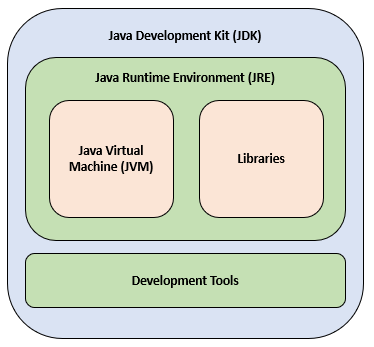

The JDK also includes the standard Java libraries so developers can use them in the programs they develop. These libraries are a collection of pre-written code that developers can use to perform specific tasks without having to write the code from scratch. Libraries help save time and effort by providing ready-made solutions for common programming tasks. 

Lastly, there is the Java programming language, which is what Java programs are written in. Think of a programming language as a formal, highly structured syntax that describes to the computer exactly what the software should do. It serves as a bridge between human logic and machine operations, allowing developers to create software, applications, and systems. It has strict syntax rules, like any written language. Most of the syntax is borrowed from earlier languages, including C and C++. This made learning Java easier for developers when it first came out. Most modern languages have kept this overall style of syntax.

## Java Goals
One of the main goals of Java, and the reason it has so many parts to it, is that it is platform independent. That means it doesn't matter if the Java program is running on Windows, Linux, Mac, or in the cloud. It should run the same way regardless of where it's executed. This is called WORA, or "Write Once, Run Anywhere". For the most part it does work, although there are rare occasions where some quirk might cause one platform to do something differently than another. Each of these platforms has their own specific JVM written just for that platform. The JVM is what runs the programs by translating the Java Bytecode into instructions for that specific platform.  

This extra layer of the JVM enables the "Write Once, Run Anywhere" capability. It also greatly simplifies managing the memory usage in an application. Before Java, developers using languages like C and C++ had to directly configure getting and returning memory to and from the operating system and is one of the biggest sources of bugs in modern software. Java has something built into the JVM called the garbage collector which automatically returns memory to the operating system. The way Java does this makes it a memory-safe programming language with robust features to help prevent common problems like memory leaks and buffer overflows. This extra layer can cause Java programs to run a little slower than a language that does not use a virtual machine or interpreter. On modern hardware the difference is negligible though.

## Java is Object Oriented
The Java programming language is known as an Object-Oriented Language. This means that the Java language uses a concept like nouns to represent the data and verbs for the actions the program will use to create the overall application. 

An object is a piece of software that represents a person, place, thing, or idea. An object will have characteristics, implemented as attributes, and it will have actions it can take, implemented as methods. The JDK library is a large collection of pre-built objects that a developer can use to solve their programming problem without having to reinvent the wheel. Later, you will learn to create your own objects as well.

Object-Oriented programming is one of the four programming paradigms (Table 1.1), and the most widely used. A programming paradigm is a very high-level style or approach to structuring and designing software solutions.  It represents a method or style of programming that defines how code is organized and how problems are solved using a programming language.

### Programming Paradigms
- Imperative: Focuses on describing how a program operates
- Declarative: Focuses on what the program should accomplish
- Object-Oriented: Based on the concept of "objects" containing data and code
- Functional: Treats computation as the evaluation of mathematical functions

## Language Charateristics
All programming languages share a few key characteristics, including Java.  These are:

- ***Keywords*** - Reserved words with predefined meanings in the language (e.g., "if", "while", "class").
- ***Data Types*** - Specifications for different kinds of data (e.g., integers, strings, booleans).
- ***Variables*** - Named storage locations for data.
- ***Operators*** - Symbols that tell the compiler to perform specific mathematical or logical manipulations.
- ***Control Structures*** - Mechanisms that control the flow of execution (e.g., loops, conditionals).
- ***Methods*** - Reusable blocks of code that perform specific tasks.

This means that learning your first programming language is often very challenging, because all these concepts are new.  Learning a second or third programming language is much easier because you already know these concepts and now are mostly learning the syntax and rules of the second language.   

## History of Java
Java was the brainchild of a software engineer at Sun Microsystems in the early 1990's named James Gosling. Originally the project was designed for digital devices like set-top boxes and refrigerators, or what we now call the Internet of Things (IoT). Gosling's goal was to create a language that was simpler and more precise than C and C++ that didn't need to be rebuilt for each platform it was running on. The first public release of Java was in 1995, and it was an instant success.  

There have been numerous updates and improvements to Java since this first release, with each version adding new capabilities and improving performance. Sun Microsystems released Java as Open-Source software in 2006 and 2007. When Oracle bought Sun Microsystems in 2010, Oracle also took over ownership and stewardship of Java and continued updating it with new releases. Perhaps most impressively, these updates generally do not break backwards compatibility. Occasionally there are what are known as breaking changes, but they are limited and well-documented. That means a Java program written in the late 1990s should still run on today's latest JVM!

## Java Versus JavaScript
One common mistake new developers often make is to confuse Java and JavaScript as the same thing. It's like saying car and carpet are the same thing because they both begin with the word car! JavaScript was a project created by Netscape Communications Corporation for enhancing its web browser, Netscape Navigator. JavaScript provides a way to program web pages with dynamic interactivity instead of just being plain displays of information of pictures and text. It allows validating what users type in a web form in the browser before that form is submitted to the web server and allows web pages to respond interactively like desktop applications. JavaScript was a major leap forward in the world wide web.

JavaScript was created by a software engineer at Netscape named Brendan Eich, and was originally called Mocha, then renamed LiveScript, and finally was named JavaScript. The name JavaScript was chosen in large part to capitalize on the popularity of Java from Sun Microsystems. The name is a marketing stunt basically, and that is literally their only connection to each other. They were invented by different people in different companies and solve different problems.  In short, Java is not JavaScript!

# BlueJ
The integrated development environment (IDE) that we'll use throughout this text is [BlueJ](https://bluej.org). This IDE is great for learning Java if you've had no prior programming experience because it gives you visual representations of the abstract concepts we'll cover in the text. It is available on Windows, Mac OS, and Linux platforms.

<caption><strong>Figure 1.2: BlueJ - Main Window.</strong></caption>

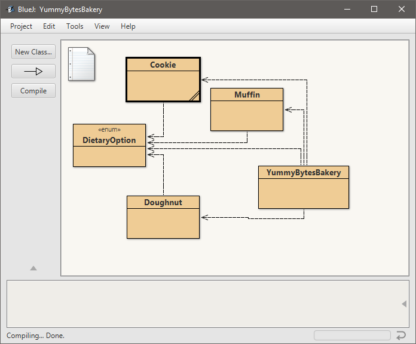
 

The main area of BlueJ shows the components of your application. For this text we will predominantly work with classes which contain the source code for their respective parts of the application. These are shown as yellow boxes. If classes interact with each other, that relationship is shown with an arrow.

<caption><strong>Figure 1.3: BlueJ - Classes.</strong></caption>

On the left-hand side you'll see buttons that will allow you to create new classes and compile your code. What compile does is it takes all of your source code that you've created inside of each of these classes and converts it into Bytecode that the JVM understands.

<caption><strong>Figure 1.4: BlueJ - New classes and compile.</strong></caption>

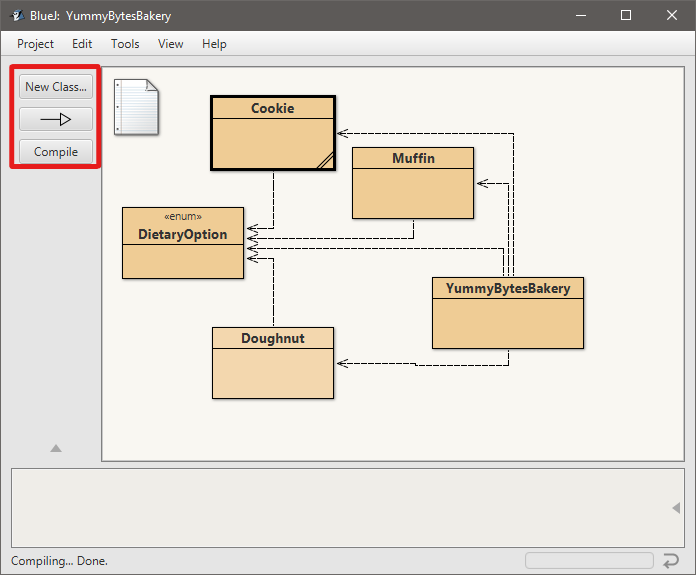

At the bottom of the main window is the object bench. Every instance of our classes that we are creating will show up here. You can interact with them independently or inspect them to see what their state is.

<caption><strong>Figure 1.5: BlueJ - Object bench.</strong></caption>

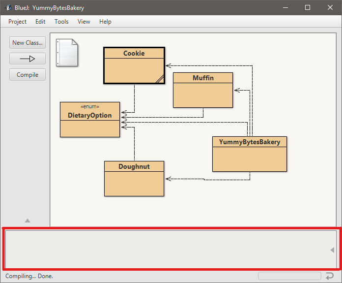

When you double-click on one of the yellow classes, it will bring up your code editor. This is source code that defines your classes. You can have multiple classes open within the editor. Each one will have its own tab across the top. 

<caption><strong>Figure 1.6: BlueJ - Code editor.</strong></caption>

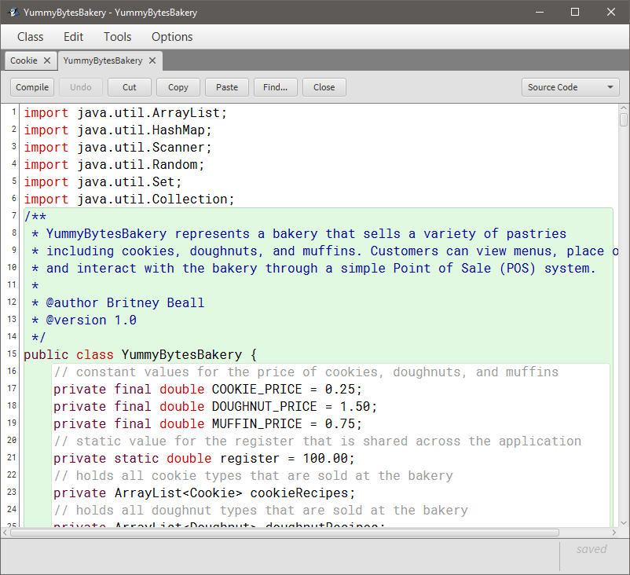

You'll notice on the left-hand side of the editor there are line numbers. This helps give you an easy way to reference statements within your code when discussing your code with other programmers. By default, this is turned off. To turn the line number display on, go to the main window, select 'Tools', then 'Preferences' (Figure 1.7) Another window will be displayed with user preferences. Make sure that the "Display line numbers" option is selected (Figure 1.8).

<caption><strong>Figure 1.7: BlueJ - User preference menu option.</strong></caption>

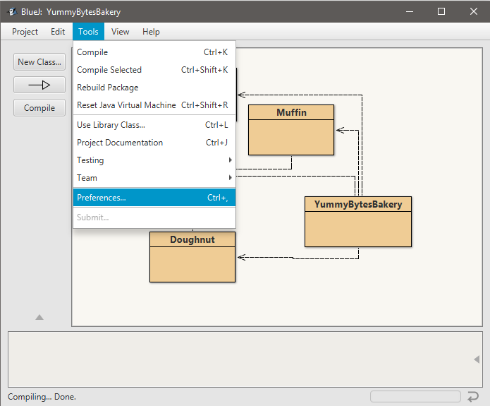

<caption><strong>Figure 1.8: BlueJ - "Display line numbers" option.</strong></caption>

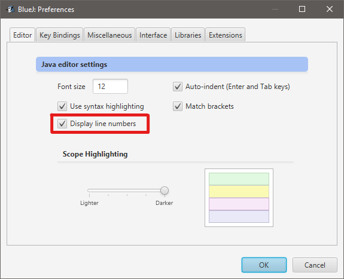

Back in our code editor you'll notice that any changes made, whether it's adding, deleting, or modifying code, will be shown as not compiled. We know this because of the grey color behind the line numbers.

<caption><strong>Figure 1.9: BlueJ - Non-compiled code in the code editor.</strong></caption>

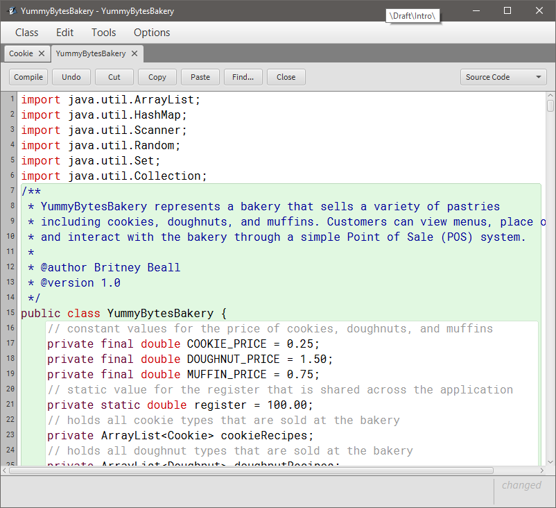

In addition, if we go back to the main window we'll see that both the Cookie class and the YummyBytesBakery class have grey slashes across it. This is another indicator saying that these two particular classes have not been compiled. Once we select the 'Compile' button on the left-hand side of the main window, those classes will return back to their solid, yellow color, and your application will be able to run.

<caption><strong>Figure 1.10: BlueJ - Non-compiled code in the main window.</strong></caption>

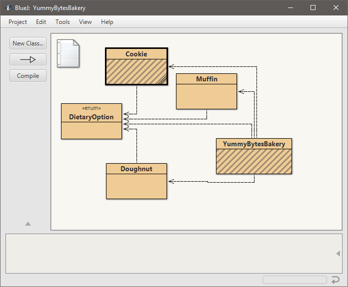 

If you run into a situation where you have a syntax error, BlueJ will notify you in four areas in the code editor. First, the class tab in the code editor will be underlined in red. Next, on the left-hand side, BlueJ will highlight the line number where the error has occurred. On that line it will also underline the area where the error starts. In this case it's at the very end of line 18. Finally, in the bottom right-hand corner you will see an error message. This tells you how many errors have occurred within this particular file. If you click on the red error message, it will take you to where the first error has occurred. This is very helpful especially when working with large classes.

<caption><strong>Figure 1.11: BlueJ - Syntax error notifications in the code editor.</strong></caption>

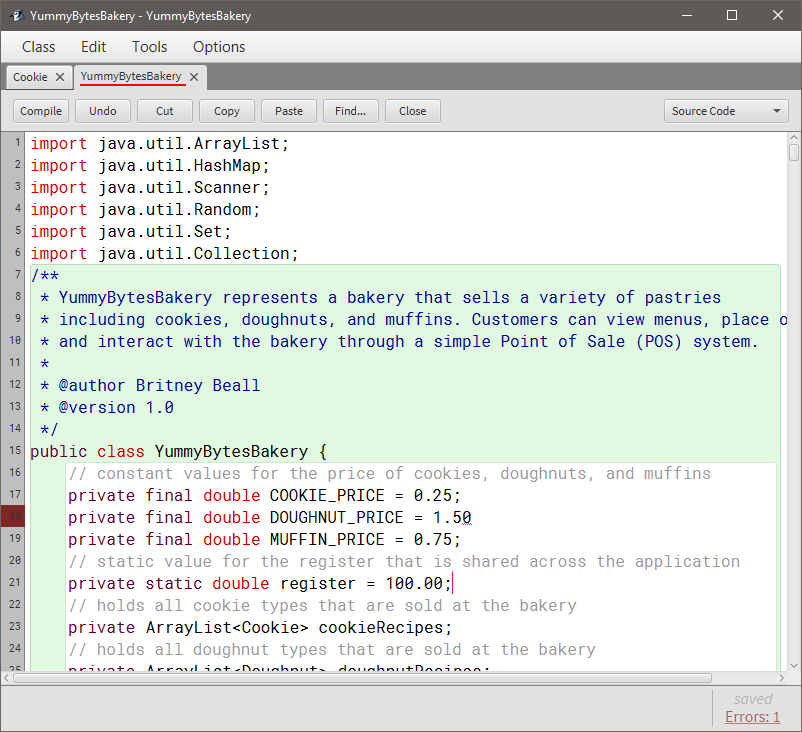

Back in the main editor, we can see that our Cookie class has a syntax error within it. This is shown by the red, crosshatched appearance. Once we correct those errors it will turn back to grey slashes meaning that it's not compiled. Then after it's compiled it will return back to its solid yellow color.

<caption><strong>Figure 1.12: BlueJ Syntax error notification in the main window.</strong></caption>

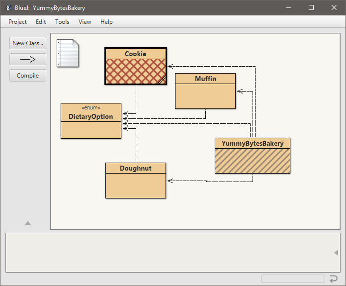

Throughout the text we will be utilizing two additional windows. Those are the debugger and the terminal. If for any reason you do not see them, you can go to the 'View' menu and select whichever window you need to see.

<caption><strong>Figure 1.13: BlueJ - View menu options.</strong></caption>

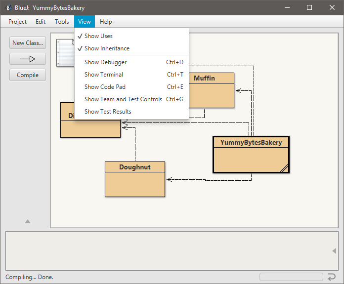

# Project Notes
## Course Management System
The Course Management System will be featured throughout the text for code examples. It is designed to manage several aspects of a college course. Students can be added to the system, and enrolled in courses. Assignments with multiple choice and true/false questions can be added to courses. Students can submit their answers to these assignments. Finally, grades for the assignments can be displayed for each student.

## Yummy Bytes Bakery
Yummy Bytes Bakery is the application that will be used as the ongoing assignment for this text. Each module's assignment will build upon the previous module's work. The Yummy Bytes Bakery system is a point-of-sale, text-based Java application. It is used to view and purchase three types of pastries: doughnuts, muffins, and cookies. The bakery offers a menu with various types of the respective pastries, and they each contain a dietary option for those with certain dietary preferences or needs. Customers can view the different types of pastries that are offered at the bakery, and they can purchase from display cases that are filled each time the application is run.    

## Fuzzy Bytes Pet Adoption System
Fuzzy Bytes Pet Adoption System is an inventory management, text-based Java application that manages adoptable pets at an animal shelter. It is used to view and adopt three types of pets: dogs, cats, and birds. The adoption agency offers an application menu of various pets of each type, and they each contain unique attributes specific to their species (such as house training for dogs, indoor/outdoor preferences for cats, and wingspan for birds). Users can view the different types of pets that are available at the shelter, and they can adopt from the available inventory that is populated each time the application is run.
