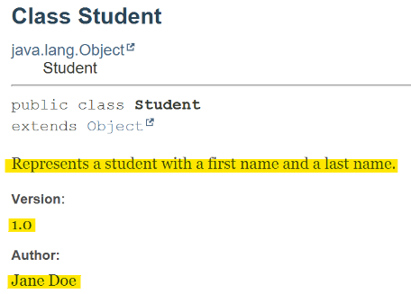
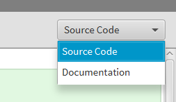
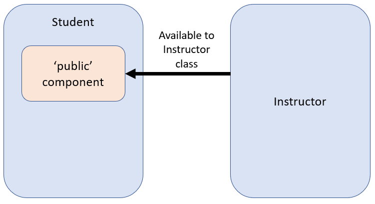
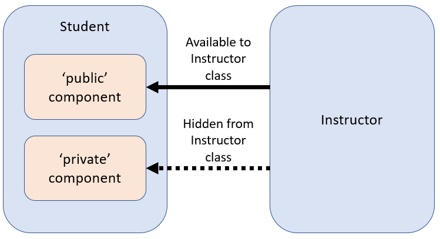
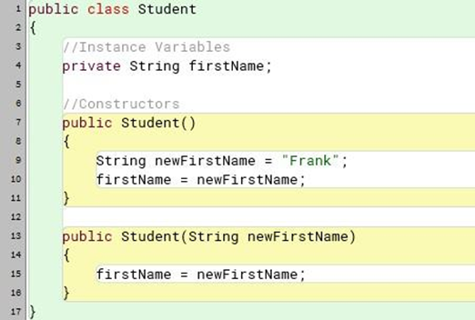
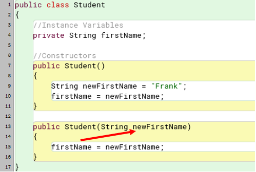
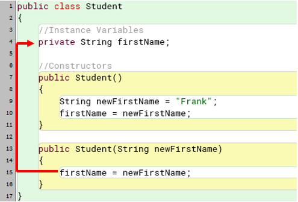
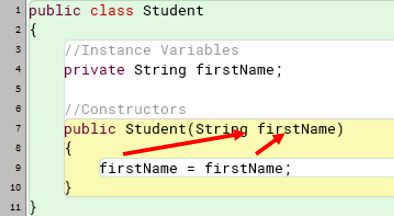
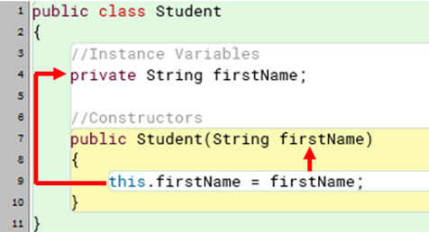

# Introduction
In the realm of programming, understanding the fundamental concepts of objects, classes, and instances is crucial. These terms, though often used interchangeably, hold distinct meanings and functions within object-oriented programming (OOP). This module will delve into these concepts through tangible analogies and practical examples, using a course management application as our framework. We will start to explore core components that define a class, such as instance variables and constructors. Additionally, we will touch on key aspects like naming conventions, data types, and the significance of comments in code. 

## Learning Objectives
- Explain the differences between classes, objects, and instances.
- Implement a Java class.
- Explain naming conventions for classes and instance variables.
- Apply comments and documentation to code.
- Describe and utilize primitive and object data types.
- Implement default and overloaded constructors.
- Create variables, and assign data to them.
- Create and utilize parameters in constructors.
- Explain the use of the 'this' keyword.


# Objects, Classes, and Instances
Before we start getting into the technical details and how to write the code for an application, we're going to take a step back and look at basic terminology from a tangible perspective.

## Objects
An architect is looking to build a new housing development. They generally start out with some sort of conceptual design. This is our object. An ***object***, in the context of programming, is a person, place, thing, or idea that we want to replicate in a digital format. In our case, the architect wants to build a house. In order to do this, they will need to create a set of instructions so that the construction company has something to build from.


<div align="center">
<caption><strong>Figure 2.1: "House" by Jason Pratt is licensed under CC BY 2.0.</strong></caption>


</div>

## Classes
The blueprints that are developed by the architect give details as to the number of rooms the house will have, how large each of the rooms should be, or what color siding it should have. All of the characteristics of the house are getting written inside of this blueprint.

From a programming perspective, this blueprint is a ***class***. It's a series of instructions that the application can use to build our digital objects. It contains all of the characteristics of our object, as well as a series of actions that our object can perform.


<div align="center">
<caption><strong>Figure 2.2: "House Plans: Ground Floor" by Fugue is licensed under CC BY-SA 2.0.</strong></caption>


</div>


## Instances
Let's say the construction company builds five houses from these blueprints. As people start buying and moving into those houses, they will add their own spin to it. They will paint the rooms. They will start decorating, and store their stuff in the closets. They will make the house unique. 


<div align="center">
<caption><strong>Figure 2.3: "Little Neighborhood" by Rachel Elaine. is licensed under CC BY 2.0.</strong></caption>


</div>

From a programming perspective, this individual house is known as an ***instance***. An instance is a digital representation of the class, or blueprint, that holds all of the distinct information and data for the application to use. Even though there are multiple object iterations made from the class, each one is distinct from another. 


# Defining a Class
Now that we know the difference between an object, class, and instance, let's start creating an application. Throughout this text we will create a course management application. It will have a place to store student information, assignments, and a gradebook. For this module, we will start defining our first object, a student.

There are several components that are within a class. Starting out, we are going to deal with four sections: instance variables, constructors, getters and setters, and all other methods. In this module we will focus on the first two sections.

```java
public class Student
{
    //instance variables
    //constructor(s)
    //getters and setters
    //"other" methods
}
```

The class header consists of the keywords public and class, and a name. The public keyword is a visibility modifier. It just means that any class within the application can see it. We'll elaborate on this a little more in the next module.

## Keywords/Reserved Words
***Keywords***, or reserved words, are a set of commands that a Java compiler recognizes. These commands get translated into Bytecode that the Java Virtual machine (JVM) uses to then process data. In our example, class is a keyword that tells the Java compiler that this section of code will define an object. These words cannot be used as class, variable, or method names in our code.

A list of [Java keywords](https://docs.oracle.com/javase/tutorial/java/nutsandbolts/_keywords.html) can be found in Oracle's Java documentation .


# Naming Conventions
When you create your class, you need to give it a name that clearly states what this class is responsible for. If I am trying to create a class that will define an employee at a company, I will call the class Employee. If I were to create a class that will help define different pets, I would call it Animal.

The rationale behind this is to provide a clear theme for the class. This will allow other programmers to quickly get a sense of what is contained within your code without needing to dig into the details of it.

***Naming conventions*** suggest that your class name should be capitalized or Pascal case. That way, programmers reading your code will quickly associate the name with a class. For the course management application, we would create the class header as such.

```java
public class Student
{
    ...
}
```

If you have a class name made up of multiple words, such as a class defining a college professor, each word would be capitalized. This is for legibility.

```java
public class CollegeProfessor
{
    ...
}
```

You'll notice that in each example there is a set of curly brackets directly after that class heading. This is a ***code block***. In Java, a code block contains a set of executable statements. The brackets help break up a large source code file into manageable chunks, so you can see what's related to what. In our case, everything that is going to belong to the class definition is going to be directly after the class header.


# Comments
One of the more useful, but often forgotten, things that we can do within our code is leave notes for ourselves and other programmers. We do that through the use of ***comments***. These notes remind us what we're planning to do in our code. It also provides insight for the programmers that inherit our application. In Java, there are two different types of comments: single-line, and multi-line.

## Single-line Comments
***Single-line comments***, which use two forward slashes `//`, means anything after this point to the very end of the line is going to be deemed a comment. They are not considered part of the application's functionality.

```java
public class Student
{
	//This is an example of a single line comment
}
```

Single-line comments can exist on their own line like the above example. It can also be included at the end of an executable line of code

```java
public class Student //Class header is compiled. Comment is ignored.
{
	...
}
```

Comments have a wide variety of uses in programming.
- Component descriptions
- To-dos
- Troubleshooting
- General information

Below is an example of how each of these types of comments can be used. 

```java
//Student class: created June 1, 2024
public class Student
{
	//instance variables (component description)
	private String firstName;
	private String lastName;

	public Student(String firstName, String lastName)
	{
		//TODO: Need to add character length validation before setting
		this.firstName = firstName; 
		this.lastName = lastName;
	}

	//This returns a student's full name in last, first order
	//EX: Smith, John
	public String getFullName()
	{
		return lastName + " " + firstName;
	}

	public void printStylishName()
	{
		String tempName = firstName.toUpperCase() + " " + lastName.toLowerCase();

		//This isn't working the way I wanted. Trying something else.
		//System.out.println("\\ " + tempName + " \\");	

		System.out.println("~*~*~*~ " + tempName + " ~*~*~*~");
		//WHY DOES THIS EXIST!?!?!?!
	}
}
``` 

Even though it may seem ridiculous to describe what is happening with a section of code instead of just reading it, it makes a massive difference when you inherit a large-scale application. Not only do you get a brief summary of what a section of code is trying to accomplish, you also get to know what another programmer was thinking at that point in time.

## Multi-line Comments
***Multi-line comments*** are an alternative way of leaving component descriptions in your code. Every class that you're creating, and almost every action that our class is going to take, will have some sort of description attached to it. 

The syntax used to declare a multi-line comment has a start `/*` and an end `*/`. Everything written between those symbols is deemed a comment and will be ignored by the compiler. As the name suggests this comment can start on one line and end on a lower line, and all text contained between them will be part of the comment. Below is a code snippet from the single-line comments. While there is nothing wrong with using single-line comments over multiple lines, we can clean it up for ease of readability.

```java
//This returns a student's full name in last, first order
//EX: Smith, John
public String getFullName()
{
    return lastName + " " + firstName;
}
```


If we were to convert this example's single-line comment to multi-line it would look like this.

```java
/* 
 This returns a student's full name in last, first order
 EX: Smith, John
*/
public String getFullName()
{
    return lastName + " " + firstName;
}
```

## Javadoc - Class Level
***Javadoc*** comments are used to describe what a class and its methods are doing in simple terms. Javadoc acts as somewhat of a user guide to a class and its components; it provides a direct explanation of what each unit accomplishes without describing how it functions. The syntax used to declare a Javadoc comment has a start `/**` and an end `*/`. The Javadoc comment is written above each class and method header. Everything written between those symbols is deemed a Javadoc comment and will be picked up by the Javadoc tool.

The Javadoc tool is provided by Java as a way to generate a formatted document used as a guide for the class. The document provides the reader with all the information needed to implement and use the class without reading its code file.

There are different tags that further define what the documentation is describing. At the class level, you have the tags `@author` and `@version` shown on lines 4 and 5 in the code segment below. The `@author` tag lists who worked on this particular class. This is useful in keeping track of who wrote the original code, as well as anyone else who has modified it. 

```java
 /**
 * Represents a student with a first name and a last name.
 *
 * @author Jane Doe
 * @version 1.0
 */
```

The `@version` tag denotes what version, or update, this class is. How the versions are written depend on the software development team. The most common is using a major/minor version notation. In our case, the version is 1.0. This means that this is the first major version. The next update that contains small changes would be considered a minor version. When we update the documentation, the new version would be 1.1. 

Another version convention is date based. For example, a software team tracks code changes based on the update's release date. The most recent release was on June 12, 2024. The team uses a version format of YY-MM-DD. Therefore, the version number for this update is 24-06-12.

```java
/**
* Represents a student with a first name and a last name.
*
* @author Jane Doe
* @version 1.0
*/
public class Student
{
	// instance variables (component description)
 	private String firstName;
 	private String lastName;
 
 	/**
 	* Constructor for creating a new Student object.
 	*/
 	public Student(String firstName, String lastName)
 	{
 
 		this.firstName = firstName;
 		this.lastName = lastName;
 	}
 
 	/**
 	* Returns the full name of the student.
 	*/
 	public String getFullName()
 	{
 		return lastName + "  " + firstName;
	}
}
```

The generated Javadoc file for the class with our comments highlighted is shown in Figure 2.4. To view this in BlueJ, click on the dropdown box in the top right of the code editor and select 'Documentation' (Figure 2.5).

 
<div align="center">
<caption><strong>Figure 2.4: Code documentation generated using Javadoc</strong></caption>



</div>


<div align="center">
<caption><strong>Figure 2.5: Code documentation option within code editor.</strong></caption>



</div>

 

# Instance Variables
***Instance variables***, also known as ***fields***, are named references pointing to the memory location where your data will be stored. These are the characteristics that describe your class. When declaring instance variables, you will need three pieces of information: visibility, data type, and a name.
- Visibility - what parts of an application can see, or use, this variable.
- Data type - what format the data needs to be in. 
- Name - what the program is going to reference this memory location by.

## Encapsulation
The first component of our instance variable declaration is its visibility, or access modifier. It is one of the four principles of object-oriented programming known as ***encapsulation***. Encapsulation is a way to protect data in your application. This is not a cybersecurity-type of protection where you are keeping end users from accessing sensitive data. It's controlling access to fields from other classes within your application. Starting out we will cover two different keywords Java uses for encapsulation, public and private. There are other encapsulation-related keywords, but we'll only focus on these for now.

### Public
When the ***public*** attribute is used on any definition, such as our Student class definition, components within the current class and other external classes can access it. To help illustrate this we'll use the Student class and declare a second class called Instructor.

```java
public class Instructor
{
	...
}
```

If the Student class has anything that is declared public, the Instructor class can access it. This includes adding, modifying, or deleting any values that are stored within the Student class.


<div align="center">
<caption><strong>Figure 2.6: Encapsulation - public interaction with an external class.</strong></caption>



</div>


### Private
***private***, on the other hand, only allows the current class to access information contained within it. External classes cannot see or use it. 


<div align="center">
<caption><strong>Figure 2.7: Encapsulation - private interaction with an external class.</strong></caption>



</div>

The main reason why you would want to "hide" something from another class is to make sure it cannot be directly accessed or modified. You'll see why this is important in the next module when discussing updating and retrieving data through the use of methods.

Typically, all instance variables are marked as private. One of the major security principles in IT is "zero-trust". When a new end user account is added to a system, you start them out with zero permissions and access. Permissions are then added to their account only when they need them. As programmers, we want to mimic the same principle in our code. We only want to allow access to components of a class as they are needed by the application.

## Data Types
The second component of our variable declaration is the ***data type***. This is telling the compiler what format the data it's storing is going to be in. We have two different data type categories in Java: primitive and object.

### Primitive Data Types
Primitive data types are the fundamental data types in Java. The unique thing about this category is that only one value can be stored at any given time. There are eight different primitive data types :
- byte
- short
- int
- long
- float
- double
- char 
- boolean

#### Whole Numbers
byte, short, int, and long are used to store whole numbers, such as 5, -24, and 75,862. However, each one has a limit as to what values they can use based on the amount of memory allocated to it. For example, byte has 1 byte of memory allocated  to it, so it can store any value from -128 to 127. int has 4 bytes, so it can store any value between approximately -2.14 billion and 2.14 billion. The amount of memory being reserved to store data was a major factor in older application design. Since available memory was limited, developers would be more selective in what data types they would use in their applications. Now it is considered more of a minor issue thanks in part to the technology we have today. For the applications that we will create throughout this text, we will predominantly use the int data type for our whole numbers.

#### Decimal Point
float and double are used to hold decimal point values. Examples of this include -42.681 and 5.1. These data types have the same memory allocation feature as the whole number variables. float is a 32-bit data type. double is aptly named because it is a 64-bit data type, twice the size of float. 

#### Characters
If you want to store a single letter, number, or symbol, you'll want to use the char data type. In our class management application, we can use char for the letter grade of assignments. One thing to note with this data type is that you will need to surround your character with single quotes `'` when assigning or comparing values. Examples of this would be `'a'`, `'3'`, and `'@'`.


#### True or False
One of the key features of any application is the ability to make decisions. boolean data types allow us to provide the answers to these decisions. boolean variables can hold the values of `true` or `false`. These values are reserved words in Java. We will use them more when we cover condition statements.

### Object Data Types
Object types are either classes that are already created for you in Java, or they can be ones that you create yourself. This is why knowing how to create classes is important. This is how we create unique applications. The main differences between these and primitive data types is that object data types can hold more data, and they have actions or methods associated with that data.

One object data type that we will be working with in the Student class is String. This object data type is a class defined by Java. I can be assigned one or more characters unlike the char data type that can only hold one. In addition to holding a value, the String class has various methods that can modify its value. Some examples are shown in table 2.1.

<caption><strong>Table 2.1: String methods and end results.</strong></caption>

| Method              | Use                                                                                                | Original Value | New Value     |
| ------------------- | -------------------------------------------------------------------------------------------------- | -------------- | ------------- |
| *toUpperCase()*    | Capitalizes all letters                                                                            | "Hello World"  | "HELLO WORLD" |
| *toLowerCase()*     | Converts all letters to lowercase                                                                  | "Hello World"  | "hello world" |
| *replace('l', 'p')* | Replaces a given character to a new one, in this case replacing the letter 'l' with the letter 'p' | "Hello World"  | "Heppo Worpd" |


Similar in manner to char when assigning or comparing values, String values need to be enclosed in double quotes ("). As we create classes within our course management application, we will incorporate them into each other to create a fully functional system.

## Naming Convention
When it comes to naming variables, you want them to be descriptive, yet concise. Just like when you give a name to a class showing what it is responsible for, an instance variable should have a name showing what it represents. Names like *studentID*, *firstName*, and *gpa* give programmers a clear understanding of what the variables are representing. Other names like *var1* and *var2* are not descriptive enough to understand what these are. You would have to dig through the code to figure out what data these variables hold and assume what they represent. For example, let's say we have an instance variable named *var1* and it holds the value "Archer". Does the variable name give the reader any indication of what it would be used for, or the kind of data it would reference? Now if we change the variable name to *lastName*, a programmer would have a better understanding of what it was used for. 

The variable names should start with a lowercase letter with each additional word capitalized for legibility. Examples of this would be *firstName*, *major*, and *isActiveStudent*. Don't include spaces in the variable name. The compiler will treat it as two separate components and will cause syntax errors. One thing to note is that Java is a case-sensitive language. This means that if you declare a variable called *major* and later use it as *Major* (capital M), the compiler views it as two different entities.

## Declaring Instance Variables
Now that we went over the components that make up an instance variable declaration, let's put it all together in our Student class. The format for an instance variable declaration is shown below.

```java
//visibility datatype variableName;
private int studentID;
```

Instance variables are declared directly after the class header. For our Student class, we will make variables to hold the student's first and last name, their GPA, what major they're in, and if they are an actively enrolled student. Each variable declaration will also show example values that can be used later.

```java
public class Student
{
	/*
 	    INSTANCE VARIABLES		POTENTIAL VALUES
 	*/
 	private int studentID;		    //555129876
 	private String firstName;	    //"John"
 	private String lastName;	    //"Smith"
 	private double gpa; 		    //3.75
	private String major; 		    //"Computer Science"
  	private boolean isActiveStudent;    //true
}
```


# Constructors
A ***constructor*** is in charge of taking the instruction defined in a class and creating a new instance of it. In our earlier example, this is the component that builds the houses as specified in the blueprint. 

## Default Constructors
Default constructors are used to give instance variables default starting values upon an instance's creation. All constructors are public and have the same name as the class (case-sensitivity is in play here as well). Notice that at the end of the constructor header there is a set of parentheses. This is where you will create your formal parameter list where you can "ask" for additional information to use within the constructor. Since we want to define what value each instance variable is starting out with, we do not need to list anything within the parentheses. The parentheses are required to be there even if they contain nothing.

```java
public Student()
{
    //instance variables are assigned values here
}
```

## Assigning Values to Variables
Now that we have a place to store data and an appropriate location in our code to assign values, we need to know how to do it. The syntax for assigning data should look familiar if you have had any experience with algebra. Take the following equations as an example.

$$x = 5$$

$$2x + 3x = 25$$

The first equation is assigning x the value of 5. We can then substitute in 5 at any location where x is used in the second equation and get a valid result. Variables in programming act in a similar manner.

For this example, we'll create a String variable called *firstName*. 

```java
private String firstName; 
```

This declaration gives us a location in memory to store our name. Next, we need to initialize it and give it a value. Let's say the name we want to store is "Levi". To assign this value to our variable, we use the assignment operator `=`.

```java
firstName = "Levi";
```

There are a few things to note with this statement. First, notice how the data type was left out. This is because once a variable has been declared with a data type, it does not need to be redeclared. Otherwise, we'll run into issues later when processing the data.

Second, the order of the variable and data matters. You always want to state where you want to store the data, and set it equal to what you want to store.

Third, since we are dealing with a String data typed variable, we enclose the name in double quotes `"`. 

Lastly, this is a stand-alone, executable statement, so we end with a semicolon `;`. 


### How Can We Use This Data?
Just like our algebra equation, every time our program comes across the variable firstName, the application will read the saved value from the computer's memory. The application will, in a way, "replace" the variable name with the retrieved data. Below is an example of how it works from a high-level perspective. 

```java
//declaring the variable 
private String firstName; 
  
//assigning data to the variable 
firstName = "Levi"; 
 	
//value of firstName retrieved from memory
System.out.println("hello "+ firstName);  
		
//the application "replaces" the variable with its value and
//prints the statement to the console
System.out.println("hello " + "Levi"); 
```

<caption><strong>Console Output:</strong></caption> 

```
hello Levi
```

### null
When you are dealing with any object data type, you need to make sure that you have initialized the variable before trying to add, modify, or delete the values assigned to it. By default, all declared object type variables are assigned to null. ***Null*** represents the absence of a value and structure. Let's go back to the house building example from earlier. Once the architect has created their blueprint, they go out and purchase land to build on. They are "declaring" that that property will have a house built on it. At that point there is no foundation, walls, or anything else that resembles a house.

This is the point where null values occur. Nulls are in between points where there is space reserved for data, but there's no structure to save the data in. Likewise, with the house. We have a space reserved for it, but we can't start moving furniture in yet. While this can be used to our advantage later on, this causes a problem when we try to use the variable.

Using the previous code example, we'll comment out the statement at line 5. After executing this code snippet, we see that there is an issue with the output.

```java
//declaring the variable
private String firstName;  

//assigning data to the variable
//firstName = "Levi";  

//application goes into memory to retrieve the assigned value 
System.out.println("hello "+ firstName); 

//the application "replaces" the variable with its value (in this 
//case null) and prints the statement to the console
System.out.println("hello " + null); 
```

<caption><strong>Console Output:</strong></caption>

```
hello null
```


Since we have the *firstName* variable declared, but have not yet initialized or assigned it a value, null will be used in place of a retrieved value. 

### New Values
We are also able to change, or modify, the value assigned to our variables. To do this, we use another assignment statement: 

```java
//declaring the variable
private String firstName;  

//assigning data to the variable 
firstName = "Levi"; 
System.out.println ("hello " + firstName); //output #1 

//changing the data assigned to the same variable
firstName = "Bentley";  
System.out.println(hello "+ firstName); //output #2 
```

<caption><strong>Console Output:</strong></caption>

```
hello Levi
hello Bentley
```

What happens to the originally assigned value, "Levi"? When a variable is assigned a new value, the old value is discarded. Whatever was assigned last is what stays. Eventually, Java's [garbage collection process](https://www.oracle.com/webfolder/technetwork/tutorials/obe/java/gc01/index.html) will run behind the scenes and remove the discarded data from the system. The details on how the garbage collector process works is out of scope at this time due to its complexity.

### Default Constructor - Revisited
Going back to our original "default" constructor, we can now assign default values to our instance variables. Below are the starting values we will use for the Student class.

```java
public Student()
{
	studentID = 99999;
	firstName = "";
	lastName = "";
	gpa = 0.0;
	major = "Undeclared";
	isActiveStudent = false;
}
```

These starting values can be anything. Your application, its usage, and the business process its executing dictates what starting values should be used. In our case, we will always assume that a brand-new Student will be given an ID of 99999. This can be considered a dummy value which is data that would not occur during the normal usage of the application. For *firstName* and *lastName* we are using empty Strings `""`, two double quotes without spaces. These show that there is an underlying structure of a String, but nothing of note is currently being stored. This is how String is typically initialized if no starting value is available. Remember, with object data types, you cannot add, modify, or delete values without an underlying structure. We are also assuming that our new Student does not have a GPA, they have not decided what their major is, and they are currently not an actively enrolled student.


# Constructor Overloading
When we create new instances of our class, we aren't relegated to just using a single constructor. We can have multiple constructors with various levels of customization. This is called overloading. ***Overloading*** is a way for us to create a new constructor, and in the next module new methods, using the same name, but a different parameter signature. With a default constructor, we have an empty set of parentheses, so there's no formal parameters being passed in. 

```java
public Student()
{
	...
}
```

Let's create a second constructor where we're pulling in a student's name. We'll have the same constructor name, but we will add in a new parameter. ***Parameters*** allow us to bring in additional data to use within our constructors.

```java
public Student(String newFirstName)
{
	...
}
```

## Declaring a Parameter
Parameters are always declared within the parentheses. Just like instance variables, need to define what data type the parameter will be and a name to reference it by. If you want to pull in more values into your constructor, you can add more parameters separated by commas as shown below.

```java
public Student(String newFName, int newStudentID, boolean activeStudent)
{
	...
}
```

## Signatures
The order of the data types used in the parameter list is what makes up the constructor's ***signature***. It is what makes it uniquely identifiable. Below are the three signatures of the constructors we've created so far.

```java
public Student()
public Student(String)
public Student(String, int, boolean)
```

Consider the two constructors below. One has parameters asking for the student's first name and their student ID. The second is asking for their last name and student ID. The most important thing that you will need to watch out for in this situation is duplicate signatures. To us as programmers, the overloaded constructors are different in terms of context. We are asking for different names. The compiler, however, sees the constructors the same in terms of syntax.


<caption><strong>Table 2.2: Constructor overloading - signature conflicts.</strong></caption>

|Constructor Declaration|Signature|
|---|---|
|public Student(String newFName, int newStudentID)|public Student(String, int)|
|public Student(String newLName, int newStudentID)|public Student(String, int)|


If we were to flip the parameters around in the second constructor, the compiler would recognize them as two separate entities. Even though they are both using the same data types, the order of the data type has changed. Thus, making the constructors unique.


<caption><strong>Table 2.3: Constructor overloading - signature resolution.</strong></caption>

|Constructor Declaration|Signature|
|---|---|
|public Student(String newFName, int newStudentID)|public Student(String, int)|
|public Student(int newStudentID, String newLName)|public Student(int, String)|


## Local Variables and Scope
Parameters are considered ***local variables***. The difference between local variables and instance variables is that a local variable is only available within the current scope of its declaration. ***Scope*** is the section of code that a variable has access to. The instance variables are available throughout the class because they are defined within the class declaration and outside of any other declaration. Parameters and local variables are only available within the declaration where they are defined. In our example below, the *firstName* instance variable is available for use in both constructors. However, the parameter and local variables *newFirstName* are only available within their respective constructor. One very important distinction here is that the *newFirstName* variable declared in the "default" constructor is a completely separate entity than the parameter of the same name in the overloaded constructor. 

The BlueJ IDE shows the scope of each component within the class shown in Figure 2.8. Everything surrounded in green belongs to the class definition. The sections in yellow show what belongs to each constructor or method. 

Declaring local variables in a code block are similar to instance variables, but they lack a visibility modifier. Since they only exist within the current code block, visibility modifiers are not necessary. An example of this is in the default constructor on line 9. Local variables, not parameters, must also be initialized before they can be used.


<div align="center">
<caption><strong>Figure 2.8: Local variables and scope.</strong></caption>



</div>


### 'this' Keyword
The parameters that we use in our overloaded constructor can be named in one of two ways. We can either have parameters that have a unique name that is distinguishable from its related instance variable, such as *newFirstName*. 

```java
public Student(String newFirstName)
{
	firstName = newFirstName;
}
```

We can also name our parameters the same as our instance variables, in this case *firstName*. Most of the time programmers will do the latter in order to keep the names consistent and recognizable, especially with larger applications. If you keep the same variable name throughout the application it is easier to follow. 

```java
public Student(String firstName)
{
	firstName = firstName;
}
```

There's a catch though. When you have a parameter the same as your instance variable, it causes confusion in the compiler because of how it looks up variable name references. Once the compiler comes across any variable name, in our case *firstName*, it first looks locally to see if a variable of that name has been declared (Figure 2.9). If one is available, the compiler uses it. 


<div align="center">
<caption><strong>Figure 2.9: Variable lookup - step one.</strong></caption>



</div>


If the compiler doesn't find a local declaration, then expand its search to the instance variables (Figure 2.10). 


<div align="center">
<caption><strong>Figure 2.10: Variable lookup - step two.</strong></caption>



</div>

This lookup process occurs every time a variable is used. From the example with different instance and parameter names, we can see that the variables would be referenced correctly. The new information being pulled in from the parameter will be assigned to the instance variable. 

What happens when the names are the same? The same lookup process occurs, but each side of the assignment statement is referencing the same parameter Figure 2.11). The value of the parameter is being accessed and modified. The instance variable is ignored completely. 


<div align="center">
<caption><strong>Figure 2.11: Variable lookup - conflict with variables of the same name.</strong></caption>



</div>


We are able to bypass the first step of the lookup process and force the compiler to look at the instance variables by using the `this` keyword. If we modify our constructor and add the `this` keyword to the left side of our assignment statement, the compiler knows to skip the local lookup and immediately go to the instance variables (Figure 2.12).


<div align="center">
<caption><strong>Figure 2.12: Variable lookup - using 'this' keyword to bypass variable lookup step one.</strong></caption>



</div>


## State
An instance's ***state*** shows what values are being held in an instance's variables at any given time. Consider it a snapshot of an instance. Knowing the state of an instance is important when trying to troubleshoot errors inside of your code. When you are debugging an application, you are pausing the application during its execution, and you're able to get that snapshot of the instance. This allows you to try to pinpoint where values are being set correctly, what's not being set correctly, and where errors are occurring.

## Constants
***Constant*** variables hold values that cannot be modified while the application is running. This is useful in situations where a value is not likely to change, or when you do not want to allow change. Values such as sales tax or the value of gravity on Earth are good examples of constants.

### Naming Convention
Generally constant variables are in all caps with an underscore `_` separating any additional word. Again, this is to easily recognize what type of variable you are working with.

### Declaration and Initialization
Declaring a constant is similar to declaring an instance variable with the addition of the final keyword. This tells the compiler that once a value is assigned to the variable it cannot be replaced with a new value. In the Course management application, we'll create a variable to hold the maximum number of credit hours a student can take. We will use this constant later when enrolling students into classes.

```java
public final int MAX_SEMESTER_HOURS;
```

For initialization we have two options. The first option is to initialize the constant in the constructor(s) with the rest of the instance variables.

```java
public class Student
{
	public final int MAX_SEMESTER_HOURS;

	public Student()
	{
		MAX_SEMESTER_HOURS = 15;
	}
}
```

The second option is to initialize it at the same time it is declared.

```java
public class Student
{
	public final int MAX_SEMESTER_HOURS = 15;
}
```

These are the only locations where you are permitted to assign a value to a constant. Most programmers opt to declare and initialize constants at the beginning of the class. 


# Summary
**Objects:** Objects in programming represent tangible or conceptual entities that we aim to replicate digitally.

**Classes:** A class serves as a blueprint for creating objects. It outlines the properties (characteristics) and methods (actions) that define the object.

**Instances:** Instances are the unique realizations of a class. Each instance can have its own distinct data.

**Defining a Class:** To define a class, we start with a class header, which includes the keywords public and class, followed by the class name. Key components within a class include instance variables, constructors, and methods.

**Keywords/Reserved Words:** These are predefined words in Java that have special meanings and cannot be used as names for classes, variables, or methods.

**Naming Conventions:** Class and variable names should be clear, concise, and written in Pascal case (e.g., Student, Employee) or lower camelCase (e.g., studentID, firstName) respectively.

**Comments:** Comments are essential for maintaining and understanding code. Java supports single-line comments `//`, multi-line comments `/* */`, and Javadoc `/** */`.

**Instance Variables:** These are variables that hold the data for an object. They require a visibility modifier (e.g., public, private), a data type, and a name.

**Encapsulation:** This principle restricts access to certain components of an object to protect its integrity. Java uses keywords like public and private to implement encapsulation.

**Data Types:** Java has primitive data types (e.g., int, boolean) and object data types (e.g., String). Primitive types hold single values, while object types can hold more complex data and methods.

**Constructors:** Constructors initialize new instances of a class. A "default" constructor sets default values for instance variables, while overloaded constructors allow for more customization.

**Constants:** Constants hold values that do not change during the execution of a program. They are declared using the final keyword and typically named in all caps with underscores (e.g., MAX_CREDIT_HOURS).


# KEY TERMS
- Class
- Code Block
- Comments
- Constant
- Constructor
- Data Type
- Encapsulation
- Instance
- Instance Variables
- Javadoc
- Keywords
- Local Variables
- Multi-Line Comments
- Naming Conventions
- null
- Object
- Overloading
- Parameters
- private
- public
- Scope
- Signature
- Single-Line Comments
- State
- This
