# Methods

In Java, classes do not merely hold data. They also perform actions through methods. Methods are blocks of code that execute specific tasks, allowing for the processing and manipulation of data within a class. They can perform various tasks, such as calculations, report generation, and data formatting. Java provides mathematical operators and supports complex expressions. 

Java documentation is essential for describing the functionality of methods, including their return values and parameters. Proper documentation ensures that the purpose and usage of methods are clear to other developers. This, along with testing, is vital to the success of your application. Testing your code is crucial for ensuring it functions as intended. Syntax errors and logic errors are common issues developers must address. Thorough testing and debugging helps to alleviate and correct these errors.

## Learning Objectives
- Demonstrate how to declare methods with proper naming conventions.
- Understand the role of accessor and mutator methods in encapsulation.
- Describe how parameters and return types are used in methods.
- Use mathematical operators to create expressions using numbers and variables.
- Explain the concept of method overloading.
- Give examples of the use of internal and external method calls.
- Demonstrate the use of *System.out.print()* and *System.out.println()*.
- Associate escape characters with their related format.
- Describe how String methods are applied to and transform data.
- Use chaining methods to simplify tasks.
- Demonstrate the use of debugging to locate runtime errors in code.

# Declaring Methods
Besides storing data in variables, classes also have the ability to perform actions. ***Methods*** allow us to code step-by-step instructions to process data in our class.
 
Let's think about one action you take as a student: completing assignments. If we were to make a method for completing an assignment, we would need the method to do the following steps:

1.	get a copy of the assignment
2.	complete the work for the assignment (for this example let's solve the equation 2 + 2)
3.	return your copy of the assignment to the instructor

Now let's treat that assignment as an object and a Java class. We can say that our tasks as programmers will be modified to this:

1.	create an instance of the Assignment class
2.	assign the "answer" instance variable the outcome of 2 + 2
3.	return the Assignment instance to the Instructor instance

So, how do we take these written instructions and turn it into code? The general format of a method is shown below.

```java 
 public void getfirstName ()
 {
  	//code related to task goes here
 }
```

Here is the breakdown of the method header:
- `public` --> visibility
- `void` --> return type
- *getFirstName* --> method name
- `()`--> parameter list
 
We have already covered visibility. Visibility for methods is no different than visibility for classes and instance variables. Return types will be discussed with accessor methods, and the parameter list will be discussed with mutator methods.

## Naming Conventions
Naming conventions for methods are the same as instance variables. Method names start with a lowercase letter. Subsequent words are capitalized. The only thing that is different is that method names should start with a verb.

Since methods are actions that the class can take, starting the method name with a verb allows you to quickly summarize what action it is performing.

Example method names include: 
- *getFirstName*
- *calculateSalesTax*
- *generateFinancialStatement*


# Accessor Methods and Return Types
***Accessor methods***, also known as getters, are tasked with retrieving data stored in instance variables and sending it to the part of the application that is using it. This gives other classes a public way to access data stored in a privately declared variable. Below is an accessor method for the *firstName* instance variable in the Student class.

```java
 public String getFirstName() 
 { 
    return firstName; 
 }
```

The main features of an accessor method are its return type, in this case String, and the use of the `return` keyword. A ***return type*** is the gateway that allows data to leave the confines of the method to be used elsewhere in the application. This works in conjunction with the `return` keyword which states what is to be sent back out into the program (Figure 3.1). In the above example on line 3, the `return` keyword is paired with an instance variable. When this line is executed, the value associated with the variable is retrieved from memory. That value is then sent out of the method and back to where the *getFirstName()* method is used in the program.

<caption><strong>Figure 3.1: Flow of data out of a method and back into the class/program.</strong></caption>


The return type that is used must match the data type of the value being returned. If the data type of the value you're returning is an int, the return type listed in the method header must be an int. If the value is a String, the return type must be a String, etc. You will get a syntax error when they don't match (Figure 3.2).

<caption><strong>Figure 3.2: Error generated by data type mismatch.</strong></caption>


# Mutator Methods and Parameters
***Mutator methods***, or setters, allow you to modify the data assigned to an instance variable through the use of parameters. This is the public facing counterpart to accessor methods. Below is the setter for the *firstName* instance variable.

```java
 public void setFirstName(String newFirstName)
 {
    firstName = newFirstName;
 }
```

Breaking down this method we first have `public`. Again, this is giving outside classes a gateway to update a privately defined instance variable. `void` indicates that nothing will be returned back into the program. 

Within the parentheses we will create a parameter that is requesting a String value and assign it to *newFirstName*. Parameters used in methods function the same way as those used in constructors. They bring in additional data to use within the method.

Inside the method's code block is an assignment statement that sets the instance variable to the incoming parameter. One thing to note is that the data type of the parameter needs to match the data type of the instance variable you are updating. In our case, the parameter is a String data type to match the String data type of the instance variable.


# Encapsulation Revisited
Now that we have getters and setters defined, let's go back to encapsulation and how it applies to instance variables. Earlier in Module 2 we discussed the keywords `public` and `private`. These keywords determine what can be seen by external classes. Since we declared our instance variables as `private`, external classes cannot access or modify the values stored within them. This becomes an issue when different components of our application need to interact with each other. Getters and setters provide controlled access to our "hidden" instance variables. Through these, we can dictate what values can be seen, what format it's in, and what new values will be accepted.

Setters are not required for every variable. If we want to prevent any class, including the class it's defined in, from modifying a variable's data we can exclude that setter from our class. If there is not a way to modify or update the value of a variable, the variable is considered immutable. It is a read-only variable. 

Getters are recommended for instance variables, but not necessary at all times.


# "Other" Methods
The last section of our Java class is the "other" methods. These are the methods that do more than set and retrieve instance variable values. They can be used for calculating various amounts, generating and formatting reports, and more. The following sections are only the start of what you can do with methods.

## Operators
Mathematical operators in programming are no different than what you use in your math classes. The operators used in Java are in Table 3.1.	

<caption><strong>Table 3.1: Java operators</strong></caption>

| Operation      | Java Operator |
| --------------- | ------------- |
| Addition       | +             |
| Subtraction   | -             |
| Multiplication  | *             |
| Division       | /             |
| Modulo          | %             |


You'll notice a new operator that you may not have seen in math. This is the ***modulo***, or mod, operator. This and the division operators are important when dealing with integer-based equations. Since the int data types only store whole numbers, we can't use typical division equations.

For example, let's say we have an int variable and assign it the result of 7 / 5. For a normal math equation, the answer would be 1.4. The problem with using long division with int variables is the that the .4 remainder would be truncated. Yes, we could convert the variable to a double or float data type, but what if we are restricted to int?

Integer math uses concepts from long division. Using the same equation, 7 / 5, the answer for integer-based math would be 1. This is the quotient, or the number of times 5 can go into 7 evenly. 

<caption><strong>Figure 3.3: Result of division.</strong></caption>

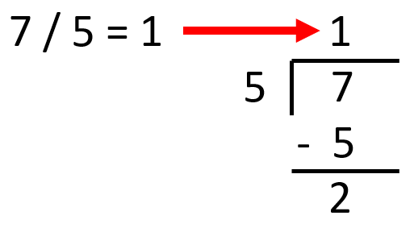
 


If we get this result from division, what happens to the remainder? This is where modulo comes into play. Modulo `%` returns only the remaining portion of an equation after division. If we change the equation to 7 % 5, we would get the answer 2.

<caption><strong>Figure 3.4: Result of modulo.</strong></caption>

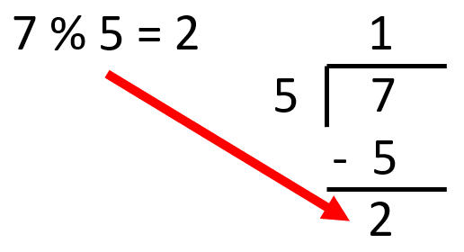
 


Modulo is useful in various circumstances. One of the easiest scenarios modulo can be used in is for determining if a number is even or odd. While we could create a method that takes in a number and compares it to a predefined list of numbers it wouldn't be practical.

```java
  public void checkEvenOdd(int numberToCheck)
  {
    //pseudocode
    If the numberToCheck is equal to 1, the number is odd.
    If the numberToCheck is equal to 2, the number is even.
    If the numberToCheck is equal to 3, the number is odd.
    If the numberToCheck is equal to 4, the number is even.
    If the numberToCheck is equal to 5, the number is odd.
    etc.
  }
```

This can be easily replaced and made scalable using modulo. 

- If any number % 2 is 0, the number is evenly divisible (6 % 2 = 0), so the number is even. 
- If any number % 2 is 1, the number is odd (5 % 2 = 1).

```java
 public void checkEvenOdd(int numberToCheck)
 {
  	//pseudocode
    If the numberToCheck % 2 is equal to 1, the number is odd.
    If the numberToCheck % 2 is equal to 0, the number is even.
 }
```

## Mathematical Equations
As we enroll students into a course, we will need to update the value stored in the *numberOfStudents* variable. One option is to create a new method that updates the variable for each student that is added.

```java
  public void enrollFirstStudent()
  {
  	numberOfStudents = 1;
  }
 
  public void enrollSecondStudent()
  {
  	numberOfStudents = 2;
  }

  public void enrollThirdStudent()
  {
  	numberOfStudents = 3;
  }
```

While it technically works, it's not the best option. It is very redundant. It's performing the same type of task over and over again, just with a different name. The methods are increasing the value of *numberOfStudents* by one each time a new student is enrolled.

We can simplify this through the use of mathematical equations. The same operations apply here as with standard math equations. We can add, subtract, multiply, and divide. The only difference is what that equation can contain. Java also provides a few beneficial short cuts as well.

To simplify the previous enrollment methods above, we can update the code block statement to *numberOfStudent* = *numberOfStudents* + 1.

```java
 public void enrollStudent()
 {
    numberOfStudents = numberOfStudents + 1;
 }
```

The equation is assigning the value of *numberOfStudents* equal to its current value plus one. If we wanted to withdraw a student from a course, we can set the value of *numberOfStudents* equal to its current value minus one.

```java
  public void withdrawStudent()
  {
   	numberOfStudents = numberOfStudents - 1;
  }
```

The methods below show other possibilities in regard to multiplication, and division respectively.

```java
  public void calulateTotalPointsPossible()
  {
  	totalPointsPossible = pointsPerQuestion * numberOfQuestions;
  }
  
  public double gradeAssignment()
  {
  	int finalGrade = correctAnswers / totalPointsPossible;
  	return finalGrade;
  }
```

### Order of Operations

PEMDAS, the acronym commonly used in math classes to define the order of operations, applies to Java math equations as well.

1.	Parentheses
2.	Exponents
3.	Multiplication
4.	Division
5.	Addition
6.	Subtraction

Let's take a look at the code segment below.

```java
 public void gradeAssignment()
 {
    finalGrade = (correctAnswers / totalPointsPossible) * 100;
 }
```

The expression on line 3 will be executed as follows:

1.	The equation in the parentheses will be resolved first. The value of *correctAnswers* will be divided by *totalPointsPossible*.
2.	The result from step 1 will be multiplied by 100.
3.	The result from step 2 will be assigned to the variable *finalGrade*.

Java does have other operators that fit into the order of operations. Most go beyond the scope of this text. A full list of them can be found in [Oracle's documentation](https://docs.oracle.com/cd/E19253-01/817-6223/chp-typeopexpr-12/index.html).

### Compound Statements

One of Java's short cuts includes the use of ***compound statements***. Take the *enrollStudent()* method from earlier. Notice how the variable is used in the equation twice. Once on the left side of the assignment operator, and once on the right side as part of the addition equation.

```java
 public void enrollStudent()
 {
    numberOfStudents = numberOfStudents + 1;
 }
```

Since we are assigning a variable the result of its current value plus one, we can use a compound statement to shorten it.

```java
 public void enrollStudent()
 {
    numberOfStudents += 1;
 }
```

The end result of this equation is the same. You can read this as "assign *numberOfStudents* the value of itself plus 1". The full list of compound statement operators is included in table 3.2.

<caption><strong>Table 3.2: Compound operators.</strong></caption>

| Compound Operator |
| --- |
| += |
| -= |
| *= |
| /= |
| %= |


These compound operators all act in a similar manner. They assign a value to a variable equal to itself with whatever operation you wish to use and another value. The code segment below shows how you would use the `-=` compound operator to decrease the value *numberOfStudents*.

```java
 public void withdrawStudent()
 {
    numberOfStudents -= 1;
 }
```

### Increment and Decrement

Another feature provided by Java is the operation of ***increment*** `++` and ***decrement*** `--`. These add and subtract one from a variable, respectively. In continuing with enrolling and withdrawing students, we can further update the methods using increment and decrement.

```java
 public void enrollStudent()
 {
    numberOfStudents++;
 }

 public void withdrawStudent()
 {
    numberOfStudents–;
 }
```

Do note that increment and decrement adjust a value by one. If you wanted to, for example, add 12 to the *numberOfStudents* value you will need to either use the standard addition operator `+` or the compound addition operator `+=`.

## Method Overloading

***Method overloading*** is the same concept as constructor overloading. Sometimes you have methods that function in a similar manner, but need different parameters. We'll use the *gradeAssignment()* method from the previous section. Currently, this method calculates a final grade using the values stored in the instance variables.

```java
 public double gradeAssignment()
 {
 	return (correctAnswers / totalPointsPossible) * 100;
 }
```

What if we want to bring in other values to use in the calculation? We can use overloading to our advantage. The same overloading rules apply to methods as they do to constructors:

1.	The name of the overloaded method needs to be the same.
2.	The method signature needs to be unique.	

The combination of the method's name and its parameter list is the method's signature. In our overloaded methods, we have the same method name as before, and two new parameters. The addition of the new parameters makes the method signature unique compared to the existing method.

```java
 public double gradeAssignment(double pCorrectAns, double pTotalPts)
 {
    return (pCorrectAns / pTotalPts) * 100;
 }
```

# Internal Method Calls
So far, we've created getters, setters, and started a few of the "other" methods. We can incorporate these methods in others through the use of ***internal method calls***. By doing this, we can reduce the number of areas where we would repeat ourselves in code, and it ensures the integrity of data through encapsulation.

Here is the original *gradeAssignment()* method.

```java
 public double gradeAssignment()
 {
    return (correctAnswers / totalPointsPossible) * 100;
 }
```

We can replace our instance variables with their respective accessor methods. Here is the updated *gradeAssignment()* method.

```java
 public double gradeAssignment()
 {
    return (getCorrectAnswers() / getTotalPointsPossible()) * 100;
 }
```

Also, the mutator methods can be used to update the instance variables instead of updating the variable directly.

```java
 public void enrollStudent()
 {
    setNumberOfStudents(getNumberOfStudents() + 1);
 }
```

The compiler will process everything within the parentheses first, working out from there. We will look at order of precedence in more detail in the ["Strings and Integers"](#strings-and-integers) section of this module.

1.	*getNumberOfStudents()* is called, returning the value associated with the *numberOfStudents* variable.
2.	One is added to the previously returned value.
3.	The end result of that equation is not the value being passed into the *setNumberOfStudents()* method as a parameter.

The *setNumberOfStudents()* method is called, updating the *numberOfStudents* variable with the value from the parameter.


# System.out.print() and System.out.println()
One way that an end user can interact with our programs is through a command line interface (CLI). Sometimes called a console or terminal, the CLI provides a rudimentary way to view and manipulate data in an application. Starting out we will display data to the end user in the console. Later on, we will ask the user for input through the console. 

The methods ***System.out.print()*** and ***System.out.println()*** are used to display data to the end user. Both of these are built into the Java programming language, and are housed in the System class. This [class](https://docs.oracle.com/javase/8/docs/api/java/lang/System.html) provides functionality with standard input and output among other things. 

*print()* and *println()* are part of standard output. Both function in a similar manner. They ask for data to display through a parameter, and then "prints" the data on the screen. The difference lies in where they start printing.

When *print()* is called, it takes the data it's given and displays it. 

```java
 System.out.print("Hello World");
```

<caption><strong>Figure 3.5: Example output for System.out.print().</strong></caption>


 


When we call the same method again, this time providing new data, it will append the new data directly to the end of the previous statement. The starting point of the new line remains at the end of the previous line.

```java
 System.out.print("Hello world");
 System.out.print("How are you?");
```

<caption><strong>Figure 3.6: Example output for System.out.print() showing appended message.</strong></caption>


Notice how there are no spaces separating the two statements. The data that we are passing in is called a ***String literal***, meaning that everything within the double quotes will be used exactly as it is. If we modified our "Hello world" statement to include a space at the end ("Hello world "), it would show up in the console screen.

```java
 System.out.print("Hello world ");
 System.out.print("How are you?");
```

<caption><strong>Figure 3.7: Example output with modified String literal.</strong></caption>


 

When *println()* is used, it will automatically adjust the starting point of the next statement to the line directly below it.

```java
 System.out.println("Hello world");
 System.out.println("How are you?");
```

<caption><strong>Figure 3.8: Example output for System.out.println().</strong></caption>


## Concatenation
Sometimes the data we want to present to the end user are in different areas of the application. Other times the data alone does not provide enough context to be valuable. With ***concatenation***, we can piece together various bits of data to make useful information for the end user. It is similar to adding in math, but instead of finding the sum, it's sticking several pieces together into one coherent phrase.

Currently in our Student class we have two instance variables that store a student's first and last name. If we use *print()*, the names are combined into one word.

```java
 firstName = "Eric";
 lastName = "Bryon"; 
 System.out.print(firstName);
 System.out.print(lastName);
```

<caption><strong>Console Output:</strong></caption>

```
 EricBryon
```

If we use *println()*, the name is legible, but broken up onto two lines.

```java
 firstName = "Eric";
 lastName = "Bryon";
 System.out.println(firstName);
 System.out.println(lastName);
```

<caption><strong>Console Output:</strong></caption>

```
 Eric
 Bryon
```


Whether it's displayed on a computer screen or printed on a piece of paper, names are usually listed on a single line separated by either a space or a comma. This is where concatenation comes into play. Using the concatenation operator `+` we can combine the variables with another string to put the student's name in the correct format.

```java
 System.out.print(firstName + " " + lastName);
```

<caption><strong>Console Output:</strong></caption>

```
Eric Bryon
```


We can also change up the format listing the student's last name first.

```java
 System.out.print(lastName + ", "+ firstName);
```

<caption><strong>Console Output:</strong></caption>

```
 Bryon, Eric
```

We can also provide context information stating that this is a student's name.

```java
 System.out.print("Student's name: " + lastName + ", " + firstName);
```

<caption><strong>Console Output:</strong></caption>

```
 Student's name: Bryon, Eric
```


## Strings and Integers
Even with the formatting advantages of concatenation, it still has quirks. When working with strings and integers, order matters. Since the concatenation operator is the same as the mathematical addition operator, it alters how the final output is displayed.

If an equation comes before a String, the expression is resolved first then the result is concatenated with the String.

```java
 System.out.print(2 + 5 + "Hello");
```

<caption><strong>Console Output:</strong></caption>

```
 7Hello
```

If a String comes before an equation, the compiler treats each integer as separate entities concatenating it with the previous String.

```java
 System.out.print("Hello" + 2 + 5);
```

<caption><strong>Console Output:</strong></caption>

```
 Hello25
```

## Escape Characters
***Escape characters*** provide additional formatting capabilities to strings. A few of the escape characters are listed in Table 3.3.

<caption><strong>Table 3.3: Java escape characters</strong></caption>

|Escape Character	|Function|
|---|---|
|\n	|new line|
|\t	|tab|
|\"	|double quote|


Escape characters have to be used inside of double quotes. They do not need a space before or after them. How they work is once the escape character `\` is reached, the compiler looks at the next character. This acts as a mini command in some cases.

The new line character `\n` acts similar to println(). It moves the starting point of what follows it to the next line.

```java
 System.out.print("Hello\nWorld");
```

<caption><strong>Console Output:</strong></caption>

```
 Hello
 World
```


Tab `\t` inserts an indentation in your statement similar to hitting tab on your keyboard.

```java
 System.out.print("Hello\tWorld");
```

<caption><strong>Console Output:</strong></caption>

```
 Hello	World
```

Using the double quote escape character `\"` allows you to use double quotes within a String. Without the escape character the compiler thinks that the String ends after 'o'. The escape character allows us to bypass a normal operation in this case.

```java
 System.out.print("Hello \"World\"");
```

<caption><strong>Console Output:</strong></caption>

```
 Hello "World"
```

Other escape characters are available in [Oracle's Java tutorials](https://docs.oracle.com/javase/tutorial/java/data/characters.html).


# External Method Calls
Up to this point we have been creating individual classes. Now we need to add code to make them interact with each other. We do this through ***external method calls***. This is where one class calls a method from another class. 

In our Course class, we need a way to enroll students. In order to do this, we first need to create an instance of the class we want to use. At the top of the Course class definition where the instance variables are declared, we are going to add a new variable. This time it will have the data type of Student. 

```java
  public class Course
  {
  	private String courseName;
  	private int courseID;
  	private int MAX_SEATS = 20;
  	private int numberOfStudents;
  
  	private Student student; //new instance variable
  }
```

This acts as a link between the Course and Student classes. Anytime we want to access a method defined in the Student class, we'll use the student instance variable.

## 'new' Keyword
Now that we've declared our Student variable, we need to initialize it. Remember, declaration reserved space in memory. Initialization provides the underlying structure of the object data type to interact with. The `new` keyword allows us to create a new instance of whatever object data type we are using. 

Inside the Course constructor, we'll add a statement to initialize our new Student variable. 

```java
 public Course()
 {
    this.courseName = "Unnamed";
    this.courseID = 999;
    this.numberOfStudents = 0;

    student = new Student();
 }
```

Line 7 is setting our student variable to a new instance of the Student class using the Student default constructor. 

You can also pass a pre-existing instance of the Student class as a parameter, and use that in the Course class *setStudent()* method. 

```java
 public void enrollStudent(Student student)
 {
    setStudent(student);
    numberOfStudents++;
 }
```

While both options are valid, it is best to initialize the variables using the `new` keyword in the constructor when possible. This helps prevent issues with null values as we develop our application.


## Dot Operator
Once we've initialized our variable, we can use it as a "starting point" to get to the Student methods. On line 6 in the following code segment, we are displaying the student's name in the terminal. 

```java
  public void displayCourseInformation()
  {
  	System.out.println("Course name: " + getCourseName());
  	System.out.print("Course ID: " + getCourseID() + "\n\tStudents Enrolled: " + getNumberOfStudents() + "\n");
  
  	System.out.println("Student: " + student.getLastName() + ", " + student.getFirstName());
  }
```

To call the Student class getter methods we start with the instance variable. Next, we use the ***dot operator*** `.`. This tells the compiler to go into the instance preceding it and call the following method. The method being called must be declared `public` in order for this to work. Otherwise you'll receive a syntax error stating that the method in question has private access (Figure 3.9).

<caption><strong>Figure 3.9: Private access syntax error on external method call.</strong></caption>


 

## Code Duplication
While we could create instance variables in the Course class that hold a student's name, ID, and other identifying information, this causes an issue known as ***code duplication***. This is where the same task or values are implemented in separate areas. From a small-scale perspective, like our application with only a handful of students, it may not be a significant issue. Currently, if we need to add another variable for student information, we can easily make a modification in the Student and Course classes where the information is used. However, if you were to scale this application up to one that handles thousands of students across several classes this would become a major nightmare to maintain. You would have to add the new variables in too many places with the possibilities including introducing typos or forgetting to add it to a class. By creating and using one instance per student, we significantly reduce the amount of duplicate code and simplify future maintenance tasks. 


# String Methods
Since the String data type is a class itself, you can make external method calls on String variables to manipulate its value. There are a variety of methods available in the String class. We will use a few of the methods listed below in the following example, but a full list of available methods is provided in the [Java API](https://docs.oracle.com/javase/8/docs/api/java/lang/String.html).

- *toLowerCase()* - converts the string to all lowercase letters.
- *toUpperCase()* - converts the string to all capital letters
- *substring(x, y)* - takes a subset of characters  from a starting point `x` to an end point `y`. 

The String methods return a modified String value back into the program. However, what is happening behind the scenes is that a copy of the String value is made with the modification, and is then added to the string pool. These values are kept until Java's garbage collection process is executed, discarding all of the unused strings. 

If the value of a String variable is changed, the variable points to a different location in the string pool. For example, we'll assign our *firstName* variable the value "Brianne". "Brianne" is then added to the string pool, and the *firstName* variable references, or points to, that String value.

<caption><strong>Figure 3.10: firstName is assigned a value.</strong></caption>

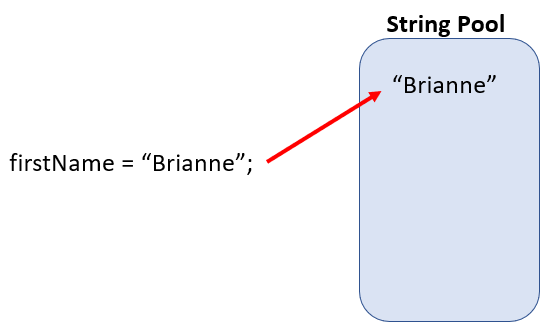
 


Next, we decide that we need to convert the name to lowercase. We'll make an external call to the *toLowerCase()* method in the String class. A copy of the original *firstName* value is made, all of the letters are converted to lowercase, and the new String is added to the pool. Since this change was applied to *firstName*, the *firstName* variable now points to the newly created String "brianne".

<caption><strong>Figure 3.11: firstName value is converted to lowercase.</strong></caption>

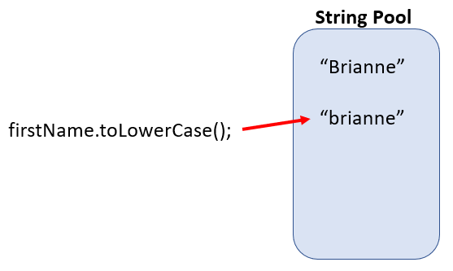
 


Let's say that the lowercase version won't work for what we're trying to do. We want to try something else using all capital letters. The same process as before applies. A copy of the current value is made, letters are converted using *toUpperCase()*, new String is added to the pool, and the variable reference point changes.

<caption><strong>Figure 3.12: firstName value is converted to upper case.</strong></caption>

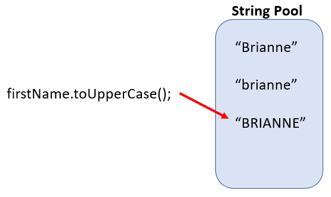
 


This process continues every time we make a modification to a String variable: pulling a subset of characters, concatenating it with new data, splitting the String in half. Every change you make creates a new String and a new reference point.

<caption><strong>Figure 3.13: Substring of first three characters of firstName.</strong></caption>

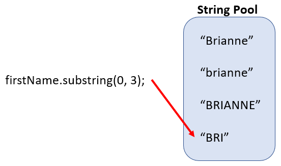
 


# Chaining Methods
***Chaining methods*** allows you to attach one method after another to generate a final result in a single, concise statement. The most important thing to remember is the output of one becomes the input of the next.

The *nameCapitalization()* method shown below is using the String *substring()*, *toUppercase()*, and *toLowerCase()* methods. This is to mimic Pascal Case where the first letter of every work is capitalized.  

```java
  public void nameCapitalization()
  {
  	//displays the current name to the terminal
  	System.out.println(firstName + " " + lastName);
  
  	/*
  	* Takes the first character of the name and capitalizes it,
  	* then concatenates with the remainder of the name in lowercase
  	*/
  	firstName = firstName.substring(0, 1).toUpperCase()	+ firstName.substring(1).toLowerCase();

 	//same as above, but for the last name
 	lastName = lastName.substring(0, 1).toUpperCase() + lastName.substring(1).toLowerCase();
    	
 	//displays the corrected name to the terminal
 	System.out.println(firstName + " " + lastName); 
  }
```

<caption><strong>Figure 3.14: Sample output of chaining methods.</strong></caption>

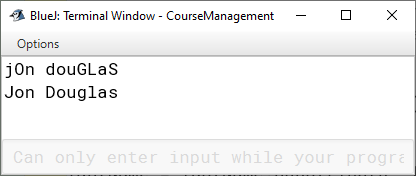


Breaking down part of the *nameCapitalization()* method, we can see how the String is modified. In Figure 3.15, we are starting with the name "eTHan". This value is stored in the *firstName* variable. That value becomes the input of the *substring()* method. In this case, it's starting at the beginning of the String and selecting the first character it comes across, "e". This value is then passed into the *toUpperCase()* method which in turn outputs the capitalized version, "E".

<caption><strong>Figure 3.15: Output of one becomes the input to the next.</strong></caption>

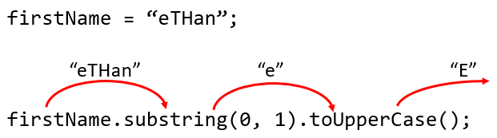


Through this small example, you can see the movement of data and how it's used in chained methods. There is no limit to how many methods you piece together. You can use String methods, your own methods, or any other combination. You do need to be aware, however, that the methods used "in the middle" (*substring()* is this situation) returns a value back into the program. If the method executes a task but does not return anything, it cannot contribute to the next chained method.

<caption><strong>Figure 3.16: Broken method chain using setLastName() as an example.</strong></caption>

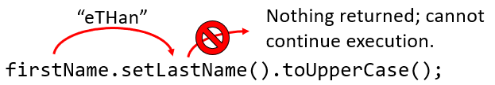


# Javadoc - Method Level
In addition to having class level tags, Javadoc has method level tags to describe what moves in and out of methods. The `@return` and `@param` tags allows you to provide context about what the return value and parameters represent.

The `@return` tag is used for any method that is returning data. On line 5 in the code sample below, the `@return` tag states that the value being returned from this method is a "calculated grade as a percentage". When other programmers are reading this documentation, they are not able to see the inner workings of the method itself. They can only rely on the method signature and the descriptions given by others.

```java
  /**
   * Calculates the final grade (percentage)
   * of the current assignment
   *
   * @return Calculated grade as a percentage
   */
  public double gradeAssignment()
  {
   	double temp = (correctAnswers / numberOfQuestions) * 100;
 	return temp;
  }
```

Figure 3.17 shows the generated Javadoc. The left column under "Modifier and Type" shows the return type, if any. The method's description from the previous code segment is highlighted.

<caption><strong>Figure 3.17: Method level Javadoc generated for return values.</strong></caption>


Further down in the generated Javadoc, each method's description is shown in more detail (Figure 3.18). Here is where the `@return` information is displayed.

<caption><strong>Figure 3.18: Detailed method level description in generated Javadoc focusing on the method return value.</strong></caption>


The `@param` tag gives you the ability to describe what each parameter is representing in a method. There are some methods you will come across in the future whose parameters may not be intuitive as to what their responsibilities are. The String class *contains()* method is one of them. Its parameter is called '*s*'. The name alone does not provide enough context as to what this parameter is used for. However, the description attached to it states that '*s*' represents "the sequence to search for" (Figure 3.19).

<caption><strong>Figure 3.19: String contains() method showing use of @param tag for meaningful descriptions of parameters.</strong></caption>


To implement this in your own code, use the `@param` tag for each parameter your method contains. You'll state the parameter name, then the description of the parameter. Lines 4 and 5 below the Javadoc descriptions for the *pCorrectAnswer* and *pTotalPoints* parameters.

```java
  /**
  * Calculates the final grade (percentage) of the current assignment
  *
  * @param pCorrectAns Total number of correctly answered questions
  * @param pTotalPts The total points possible for the assignment
  * 
  * @return The final grade calculated based on the provided 
  *         parameters returned as a percentage
  */
  public double gradeAssignment(double pCorrectAnswers, double pTotalPoints)
  {
  	double finalGrade = (pCorrectAnswers / pTotalPoints) * 100;
  
  	return finalGrade;
  }
```

The final documentation is shown in figure 3.20.

<caption><strong>Figure 3.20: Detailed method level description in generated Javadoc focusing on the method parameters.</strong></caption>


`@return` and `@param` tags are optional. Not all methods have data returned. If you have a `void` return type, there's no reason to explain that nothing will be returned from the method. Likewise, not all methods require additional data to function. 


# Return Types Revisited
Previously when talking about getters, we were returning the value stored in a variable. Now, we can create methods that can return more valuable information. Outside of the getters and setters, you can add a return type to any method you create. You can return the result of equations, such as an assignment's final grade or a concatenated String (Figures 3.21 and 3.22 respectively).

```java
  /**
   * Calculates the final grade (percentage)
   * of the current assignment
   *
   * @return Calculated grade as a percentage
   */
  public double gradeAssignment()
  {
  	return (correctAnswers / numberOfQuestions) * 100;
  }
```
 
<caption><strong>Figure 3.21: Example of return value for an equation.</strong></caption>

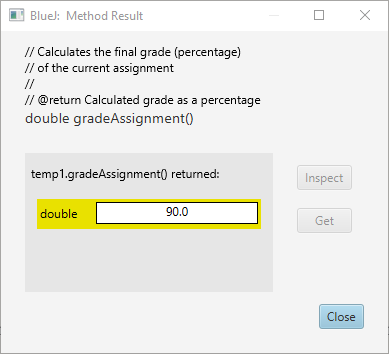


```java
  /**
   * Student's full name is returned in last  name, first name
   * format
 	 * 
 	 * @return Concatenated full name of student
   */
  public String getFullName()
  {
  		return getLastName() + ", " + getFirstName();
  }
```

<caption><strong>Figure 3.22: Example of concatenated String return value.</strong></caption>

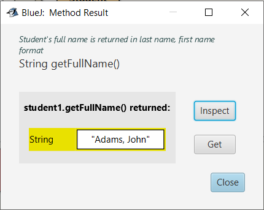


# Preliminary Testing
A good habit in software development is to implement one change or new feature at a time, and test it as you go. If you write an application and test it at the end, you'll more than likely run into several errors with no clear starting point. The errors that you'll come across can be divided into two categories: syntax and logic.

***Syntax errors*** are the easiest to spot. These are your typos, missing characters, and incomplete method calls. Similar to the spell check feature in word processing applications, syntax errors are underlined in red if you are using an IDE like BlueJ. You'll usually get a short message stating what the syntax error is, and a suggestion as to how to correct it.

***Logic errors***, on the other hand, can be very difficult to locate. Many modern software development programs have integrated debugging features that help pinpoint these errors. With ***debuggers***, you can set temporary stopping points within your code called breakpoints. As your application runs, it will stop at these breakpoints allowing you to see the state of your objects, what is being executed next, and where your errors are occurring.

## Debugger
Every development program has a different way to handle debugging. This text discusses the debugging features within the BlueJ IDE. While the overall concepts of debugging transfer across to other development programs, the exact location and presentation of the debugging information will be different.

### Setting Breakpoints
As previously stated, ***breakpoints*** are locations where you want to pause your application during its runtime. You can place them anywhere within a code block with a few exceptions:
1.	You cannot place a breakpoint on a constructor or method header lines
2.	You cannot place a breakpoint on curly brackets.
 
Initially, the best place to start placing breakpoints is where you last made a change. It takes a lot of trial and error to pinpoint a good location to start debugging as a beginner programmer. Over time, you'll learn to recognize where logical errors are more likely to occur. We'll use the *displayCourseInformation()* method to demonstrate the debugging process.

```java
  public void displayCourseInformation()
  {
  	System.out.println("Course name: " + getCourseName());
  	System.out.print("Course ID: " + getCourseID() 
  					+ "\n\tStudents Enrolled: " 
  					+ getNumberOfStudents() + "\n");
  
  	System.out.println("Student: " + student.getLastName() + "" 
  					+ student.getFirstName());
  }
```

### Debugging Window
In your code editor on the left-hand side you'll see your line numbers. If your class has been compiled, this area should be white. To add a breakpoint, click on the line number where you want to pause runtime. In our case, we'll place a breakpoint on line 122 so we can walk through the method line by line, start to finish. You should see a small stop sign with the full line marked in red, as shown in Figure 3.23. If you cannot place a breakpoint, make sure that your class has been compiled.

<caption><strong>Figure 3.23: Placing a breakpoint at the start of our method.</strong></caption>

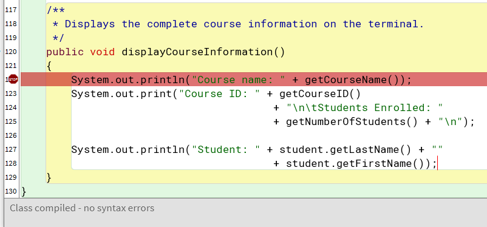


Next, create a new instance of the Course class. We'll use the overloaded constructor passing in the following information. 

<caption><strong>Figure 3.24: Selecting the overloaded constructor for the Course class.</strong></caption>


Remember, the BlueJ IDE requires String values to be enclosed in double quotes when using them in the parameter pop-up windows (Figure 3.25).

<caption><strong>Figure 3.25: Parameter pop-up window.</strong></caption>

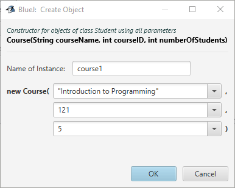


<caption><strong>Table 3.4: Parameter values for new Course instance.</strong></caption>

|Parameter| Value|
|---|---|
|courseName|	"Introduction to Programming"|
|courseID|	121|
|numberOfStudents|	5|


You should now see a red object in BlueJ's object bench. This is the instance of the Course class that you just created.

<caption><strong>Figure 3.26: New instance shown in the object bench.</strong></caption>

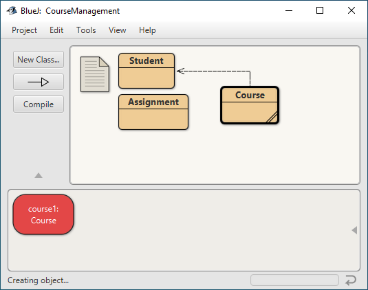


Right-click on the red object instance we created and select the ***displayCourseInformation()*** method. 

<caption><strong>Figure 3.27: Selecting the method to test.</strong></caption>


You should see a new pop-up showing the debugging window.

<caption><strong>Figure 3.28: BlueJ debugging window.</strong></caption>


This window displays all of the information that you would need for debugging your application. The window is broken up into four sections. 

The left-hand portion shows the stack trace, or call sequence. This is a record of what methods were called in order to get to the current breakpoint. This includes a mix of the methods you've created as well as ones that are built into Java.

<caption><strong>Figure 3.29: Debugging window - call sequence.</strong></caption>

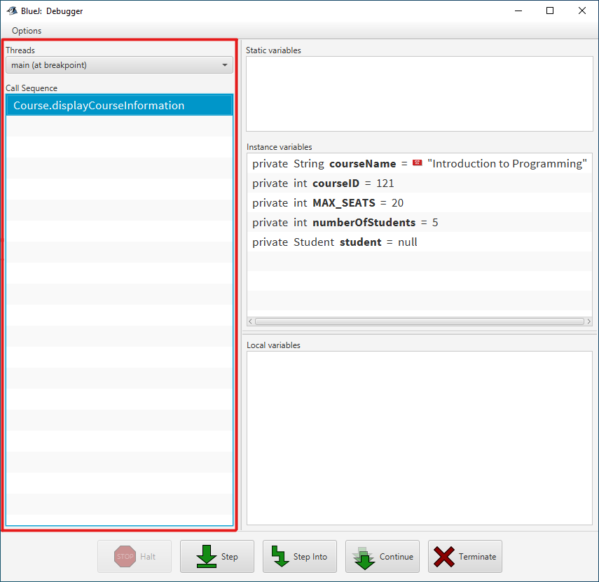


The right-hand side holds the current state of the instance we are interacting with.

<caption><strong>Figure 3.30: Debugging window - state of the current instance.</strong></caption>


At the bottom of the window, you will see five options: halt, step, step into, continue, and terminate. The next sections will go over the last four options which are used most often during debugging.

<caption><strong>Figure 3.31: Debugging window - debugging options.</strong></caption>

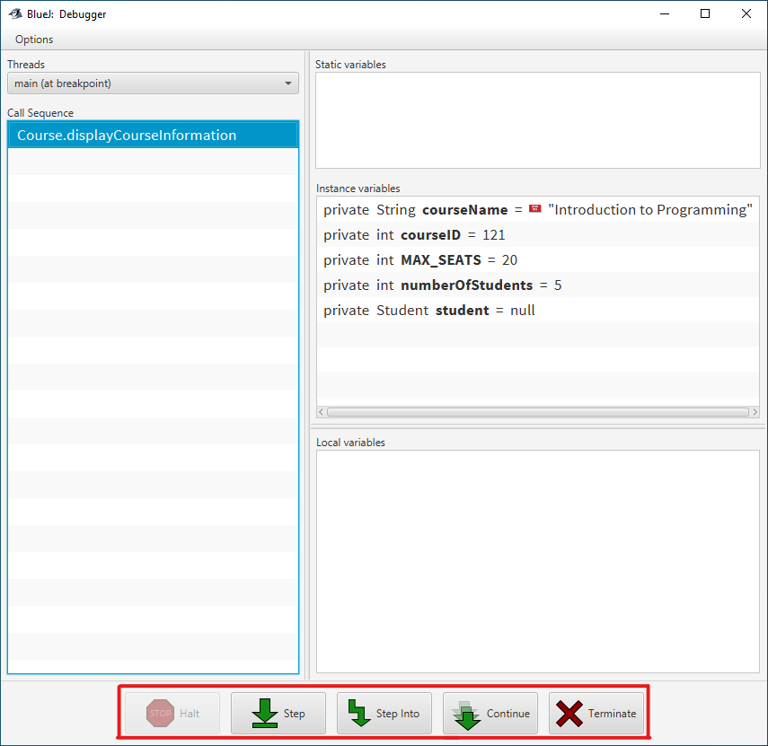


### Step
If we go back to our code editor, you'll see that the line where we place the breakpoint is now green. This is showing you that this is the next line to be executed. 'Step' will execute this highlighted line, then pause again on the next line. This is useful when you want to see what is being executed locally within the current method.

<caption><strong>Figure 3.32: Next line to execute in green.</strong></caption>


If we hit 'Step' in our example we'll notice that the terminal window opens, and "Course name: Introduction to Programming" is displayed.

<caption><strong>Figure 3.33: Line 122 has been executed, and the program has paused on line 123.</strong></caption>

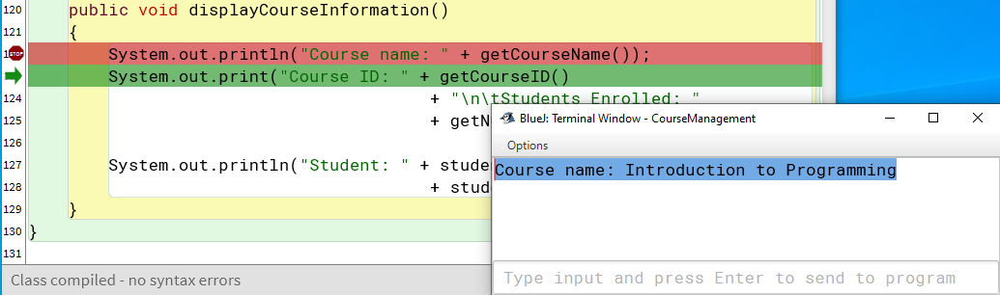


### Step Into
The next line to execute contains a method call. If we were to select 'Step', the line will execute, and we will not see what is occurring in the called method. While this may be useful, we could be missing where the error is actually occurring. 'Step Into' allows us to go into the called method and continue debugging line by line.

When we select 'Step Into', our green line has moved to the called method, *getCourseID()*. We can see that the next line to execute will return the value held in courseID.

<caption><strong>Figure 3.34: Executing called method getCourseID().</strong></caption>


If we select 'Step Into' again, we are moved back to our original starting point. The statement also called the *getNumberOfStudents()* method. Selecting 'Step Into' will jump to that method, execute any tasks within that method, then return to the *displayCourseInformation()* method. 

Once we reach the end of the statement, the course ID and the number of students enrolled are displayed in the terminal.

<caption><strong>Figure 3.35: Completed statement execution.</strong></caption>

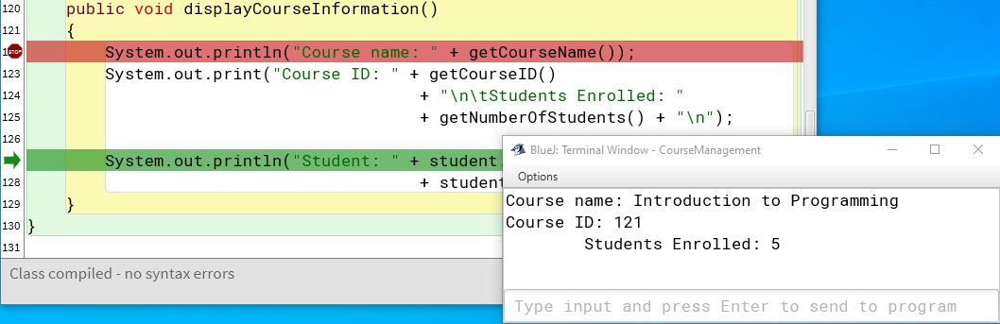


We can also see where the values displayed in the terminal are coming from in the 'Instance Variable' state section of the debugging window.

<caption><strong>Figure 3.36: Terminal display matched to related instance variables.</strong></caption>


### Continue
'Continue' resumes the normal operation of the application. Your application will run until one of the following conditions is met:

1.	Another breakpoint is reached
2.	The application successfully completes its operation
3.	The application crashes due to runtime errors.

### Terminate
The 'Terminate' option is given when a breakpoint is reached. If you found your logic error, there is no reason to continue running your program. Therefore, 'Terminate' gives you an easy way to end the execution of your program.


# Summary

**Visibility Keywords:** Methods can be declared with visibility keywords such as `public` and `private`.

**Return Type:** Methods specify a return type, which can be a primitive type, object, or `void` if no value is returned.

**Method Names:** Method names should follow camelCase convention, starting with a lowercase letter and being descriptive of the method's function.

**Accessor Methods (Getters):** These methods retrieve the value of a private variable, often following the naming convention *getVariableName()*.

**Mutator Methods (Setters):** These methods set or update the value of a private variable, typically named *setVariableName()*.

**Encapsulation:** Getters and setters provide controlled access to private variables, ensuring encapsulation and data integrity.

**Parameters:** Methods can accept parameters, allowing data to be passed into the method.

**Return Statements:** The return keyword is used to send data back to the caller. The return type specified in the method signature must match the type of data returned.

**Operators:** Java supports various operators, including arithmetic operators (`+`, `-`, `*`, `/`, `%`).

**Order of Operations:** Java follows standard mathematical order of operations (PEMDAS: Parentheses, Exponents, Multiplication and Division, Addition and Subtraction).

**Compound Statements:** These allow for more concise code, such as *variable* += 5 instead of *variable* = *variable* + 5.

**Increment/Decrement Operators:** The `++` and `--` operators increase or decrease a variable's value by one, respectively.

**Method Overloading:** Java allows multiple methods with the same name, but different parameter lists within the same class. This is useful for methods that perform similar functions with different inputs.

**Printing to the Console/Terminal:** The *System.out.print()* and *System.out.println()* methods are used for console output. The former prints on the same line, while the latter prints and moves to the next line.

**String Concatenation:** Strings can be concatenated using the `+` operator.

**Escape Characters:** Special characters like `\n` for newline and `\t` for tab are used to format strings.

**External Method Calls:** Methods are invoked using the dot operator `.` on an instance of a class.

**Creating Instances:** The new keyword is used to create new instances of a class, allowing methods and variables of that class to be accessed.

**String Methods:** Java provides numerous methods for String manipulation, such as *toLowerCase()*, *toUpperCase()*, and *substring()*.

**Method Chaining:** This technique involves calling multiple methods in a single statement, such as *variable.toUpperCase().substring(0, 3)*.

**Javadoc:** Javadoc comments provide documentation for classes and methods, using tags like `@param` for parameters and `@return` for return values. This is essential for maintaining clear and understandable code.

**Syntax Errors:** Errors due to incorrect use of Java syntax, typically caught by the compiler.

**Logic Errors:** Errors in the program's logic that lead to incorrect outcomes, often detected during testing.

**Debugger:** A debugger is a vital tool for catching logical errors.


# Key Terms
- `@param`
- `@return`
- Accessor Methods
- Breakpoints
- Chaining Methods
- Code Duplication
- Compound Statements
- Concatenation
- Debuggers
- Decrement
- Dot Operator
- Escape Characters
- External Method Calls
- Increment
- Internal Method Calls
- Logic Errors
- Method Overloading
- Methods
- Modulo
- Mutator Methods
- Return Type
- String Literal
- Syntax Errors
- *System.out.print()*
- *System.out.println()*
	


# Review Questions
1.	What is a Java method, and why is it important?
2.	What keyword is used to declare a method as accessible to any other class? Why would this type of declaration be used?
3.	What does the void keyword indicate in a method declaration?
4.	Give an example of a correct method name to display information about a person's car following Java naming conventions?
5.	What is the purpose of an accessor method?
6.	What is another name for a mutator method?
7.	What is used to pass data into a method? Why is this needed?
8.	What keyword do you use to specify the value to be returned from a method? Why would data need to be returned?
9.	What does the `*=` operator do? Give an example of its use.
10.	Which operator is used to increment a variable by one? Give an example of its use.
11.	What is method overloading? Why is overloading important?
12.	Which method is used to print a message and then move to the next line? Give an example of its use.
13.	How can you concatenate two String values in Java? Give an example of its use.
14.	What does the escape character `\n` represent? Give an example of its use and the generated output.
15.	What keyword is used to create a new instance of a class? Give an example of how it's used.
16.	How do you perform an external method call?
17.	Which method converts a String to all uppercase letters?
18.	What is method chaining? Give an example and include the generated output.
19.	What is the purpose of Javadoc comments?
20.	What tag in Javadoc is used to describe a method parameter? 
21.	What type of error is typically caught by the compiler?
22.	What type of error leads to incorrect program outcomes but does not prevent the program from running?
23.	Which tool is essential for catching syntax errors and debugging?
24.	Which keyword makes a method only accessible within its own class? Why is this type of declaration important?
25.	What is the purpose of encapsulation in Java?
26.	How are private variables accessed indirectly?
27.	What does the *substring()* method do? Give and example and include the generated output.
28.	What type of operator is `%` in Java? How is it different than the `/` operator?
29.	Which method is used to convert a String to all lowercase letters?
30.	What is the result of `5 % 2` in Java?
31.	What tag is used to describe a return value in Javadoc?
32.	What symbols are used to denote a Javadoc comment? Give an example of a Javadoc comment that include a parameter and a return value.
