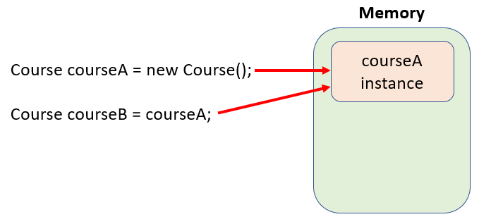
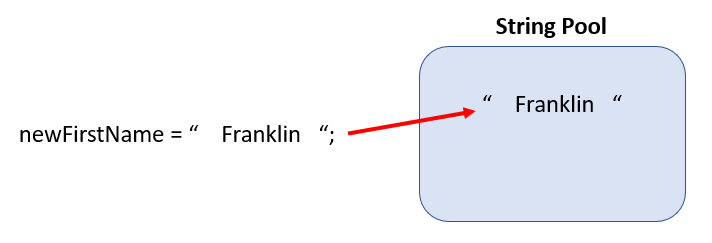
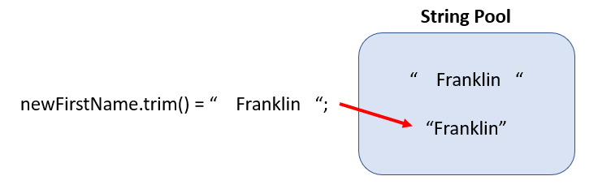

# Condition Statements
In software development, applications execute a variety of actions that hinge on two main control structures: decision-making and repetition of tasks. This module looks at decision making, exploring how applications determine which actions to perform. These decisions boil down to true or false outcomes, achieved through condition statements and comparison operators. This module examines key elements like comparison operators, object equality, logical operators, `if/else` statements, `switch` statements, and the ternary operator, offering a comprehensive understanding of decision-making in programming.

## Learning Objectives
- Understand the uses of comparison operators in condition statements.
- Use if-else for decision making in applications.
- Understand the use of the logical operators representing AND, OR, and NOT.
- Apply data validation prior to accessing or updating variable data.
- Compare and contrast the differences between `switch` and `if/else` statements.
- Implement a ternary operator for simple comparisons.


# Control Structures
When you are looking at the potential actions of an application as a whole, the functionality comes down to two main ***control structures***. One is in charge of making decisions as to which action an application should perform, and the other is repeating a set of tasks. We are going to focus on the former control structure and look at different components we can use to make decisions. 

Applications do not run in a linear fashion. Their actions are always based on what a user selects and how they interact with the system. For example, when we use a calculator application, we are not restricted to adding two numbers together and pressing enter. We are given several options, such as multiply and square root, that we can select. What we select will determine what action the application will execute. 

Decisions that are made within an application result in either a true or false answer. How we get those results is through the use of condition statements and comparison operators.


# Comparison Operators
The most important component of any condition statement is its ***comparison operator***. They define how the criteria needs to be met before a process can continue. Much like the mathematical operators, these comparison operators should look familiar. 

<caption><strong>Table 4.1: Java comparison operators.</strong></caption>

|Operator|	Description|
|---|---|
|>	|Greater than|
|<	|Less than|
|>=	|Greater than or equal to|
|<=	|Less than or equal to|
|==	|Equal to|
|!=	|Not equal to|

These comparison operators can be used in combination with variables, methods, or results of math expressions.

## Variables
Variables in condition statements act in the similar fashion as if we are using them in math expressions or print statements. The values associated with these variables are retrieved prior to making a comparison. Variables can be compared to independent values or other variables.

```java
 grade > 85
```


## Methods
Getter methods, or any other methods that have a return value, can be used in comparison statements. When the comparison is being evaluated, the method is called, a value is returned, then the comparison is made. In the example below, we are retrieving the value stored in *numberOfStudents* and comparing it to the value stored in the *MAX_SEATS_AVAILABLE* constant.

```java
 getNumberOfStudents() <= MAX_SEATS_AVAILABLE
```

## Expressions
Mathematical order of operation still applies in this situation. Everything within parentheses is evaluated first, then the comparison is made. 

```
 4 == (6 - 2)
```

Any condition statement cannot be used on its own. It must be used within control structures, such as `if/else`, `switch`, or a ternary operator.


# Object Equality
One very common task in developing applications is to compare values or instances for equality. This can be more challenging than it might first appear. Comparing primitive data types is done by using the `==` comparison operator, because primitives will simply compare the value stored in each field. But there’s a catch when comparing objects.

***Object equality*** refers to the concept of comparing two objects to determine if they are the same object. This can mean different things though, because there are two ways to think of "the same object."

## Reference Equality
Let’s create two Course variables, *courseA* and *courseB*. Since *courseB* was assigned the instance of *courseA*, both variables are referencing the same Course instance in memory (Figure 4.1). This is reference equality. If there are any changes to the state of *courseA*, they will be reflected in courseB as well. These two object references are pointing to the same memory address, so they are the same and therefore considered equal. Reference equality is tested using the `==` operator.

<caption><strong>Figure 4.1: Reference equality.</strong></caption>



## State Equality
The other way two objects can be considered equal involves the state of the two objects. Assuming they are the same type (instances of the same class), if the two different objects have the same state then they may also be considered equal. This is ***state equality***.

We’ll adjust the previous example, making *courseA* and *courseB* their own separate instances, but with the same name (Figure 4.2). If we wanted to compare the values of the variables inside of the instances, we would use the ***equals()*** method. If the values set in the *name* variable match, the instances would be considered equal.

<caption><strong>Figure 4.2: State equality.</strong></caption>


 


Since Strings are an object data type, it is better to compare these values using the *equals()* method than with `==`. The format of the comparison is shown below.

```java
string1.equals(string2)
```


For the Course example, the comparison would be set up using chained methods since we want to retrieve the names out of each instance.

```java
 courseA.getName().equals(courseB.getName)
```

# if/else Statements
***if/else statements*** determine what action to take based on the condition that is provided. If a condition is met, it applies one set of actions. Otherwise it does something else. 

Starting with the basic setup of an `if/else` statement, you have your keyword `if` and its condition. If the provided condition evaluates to true, it will execute everything that's in the code block directly below it.

```java
 if (condition)
 {
    //code to execute if condition is true
 }
```

The next section uses the keyword `else`. If the condition stated is not true, it will run the set of statements in its code block.

```java
 if (condition)
 {
    //code to execute if condition is true
 }
 else
 {
    //code to execute if condition is false
 }
```

This type of statement is scalable, meaning that you can provide as many condition statements you need. You do this by using an else if code block. The code example below shows how you can return a char value based on an assignment grade.

```java
 if (grade >= 90) //condition 1
 {
    return ‘A’;
 }
 else if (grade >= 80) //condition 2
 {
 	return ‘B’;
 }
 else if (grade >= 70) //condition 3
 {
 	return ‘C’;
 }
 else if (grade >= 60) //condition 4
 {
 	return ‘D’;
 }
 else
 {
 	return ‘F’;
 }
```

If I set the *grade* variable equal to 83, it will fail the first condition. The program will then evaluate *grade* in the second condition. Since the end result of this condition is true, the char ‘B’ will be returned. The remainder of the `if/else` statement will be ignored.

One thing that you do need to be aware of whenever you are creating an `if/else` statement with multiple conditions is that you want to order your conditions from the most specific to the most generic. Otherwise, you will risk executing incorrect statements. The code below is an example of this using the previous `if/else` statement, but with its conditions in reversed order.

```java
 if (grade >= 60) //condition 1
 {
 	return ‘D’;
 }
 else if (grade >= 70) //condition 2
 {
 	return ‘C’;
 }
 else if (grade >= 80) //condition 3
 {
 	return ‘B’;
 }
 else if (grade >= 90) //condition 4
 {
    return ‘A’;
 }
 else
 {
 	return ‘F’;
 }
```

Using the same value of 83 for *grade*, the char ‘D’ will be returned instead of the expected ‘B’ value. This is because the first condition is checking for a wider range of values (60-100+) as opposed to a narrower set like before (80-89). 

The `else if` and `else` sections are optional. If you want to execute a series of statements only when a condition is met, but don’t want to do anything otherwise, you can leave out the `else` section. It’s better to leave out the else section than to have it with nothing inside the code block.


# Logical Operators
***Logical operators*** allow you to combine different condition statements into one. There are three that are used in Java: `&&` (AND), `||` (OR), and `!` (NOT). How logical operators work is you will have a condition on the left and right-hand side of a logical operator. Each condition is going to be evaluated. The results of the individual expressions will then be evaluated with the logical operator, determining whether the entire statement is true or not. 

## AND
For the `&&` (AND) condition, all conditions must be true in order for the whole statement to be true. Let’s take the weather and create a pseudocode example from it.

```java
 if (weather == “rainy” && weather == “windy”)
 {
    Take an umbrella when going outside.
 }
 else
 {
    Leave the umbrella at home.
 }
```

In order for us to take an umbrella, it has to be rainy and windy outside. If it’s only rainy, we cannot take an umbrella. Likewise, if it’s only windy, we cannot take the umbrella.

## OR
For the `||` (OR) logical operator, only one condition needs to be true in order for the whole statement to be true. Using our previous example, if it’s rainy, but not windy, we can take our umbrella. Likewise, for if it’s windy, but not rainy. We can also take our umbrella if both statements are true.

```java
 if (weather == “rainy” || weather == “windy”)
 {
    Take an umbrella when going outside.
 }
 else
 {
    Leave the umbrella at home.
 }
```

## NOT
The `!` (NOT) logical operator works with boolean values. It takes the value given and flips it. 

For example, up to this point if we wanted to check to see if it’s not raining, we would structure our comparison statement as shown below.

```java
 if (raining != true)
 {
 	...
 }
```

The comparison statement is checking to see if the value assigned to raining is false. An alternative to this is using the not operator. This is checking for the same result of false.

```java
 if (!raining)
 {
 	...
 }
```

This operator can be confusing starting out. It requires additional consideration even for veteran programmers when reading and understanding another programmer’s code. This is one area where writing the full comparison (`raining != true`) would be more beneficial to beginners than to immediately start using the `!` operator. It allows you to get a better understanding of what’s going on in your code. As you become more proficient, then start substituting in the `!` operator where applicable.


# Encapsulation Revisited
Now that we've added condition statements into our skill set, we're going to revisit encapsulation yet again. Since we have the ability to create condition statements, we can further refine what data can be set in our mutator methods. 

## Data Validation Using Setters
We are not restricted to pulling in data through a parameter and assigning it to an instance variable with a setter. We can incorporate data validation before we assign anything to the variables. The next sections give you a glimpse of what’s possible.

### Positive Values
We can use conditional statements to make sure that we are providing a value within the expected range of values. For the variable *gpa*, for example, we want to make sure that the value that we are saving is a positive value. In typical situations you cannot have a negative GPA. We can modify our GPA setter to check the GPA coming from the parameter is greater than or equal to 0. If it meets that condition, assign the new value to *gpa*. Otherwise, don't make any changes because we cannot use a negative value.

```java
 public void setGpa(double newGPA)
 {
 	if (newGPA >= 0)
 	{
 		this.gpa = newGPA;
 	}
 }
```

Since the else section is not needed, we can exclude it from our condition statement.

### String Values Present
For the *setFirstName()* method, we can incorporate an `if/else` statement to make sure that the value passed in through the parameter contains data. Below is the original mutator method. We will assign the parameter *newFirstName* the value `“    Franklin   “` for this example. Since this is a string literal, the spaces before and after Franklin are included in the stored value.

```java
 public void setFirstName(String newFirstName)
 {
 	this.firstName = newFirstName;
 }
```

<caption><strong>Figure 4.3: Starting value of newFirstName.</strong></caption>




In order to create the condition statement, we need to know what would be considered valid data. Using the *firstName* variable, we want to assign it a value only if that value meets the criteria such as the ones listed below.
1.	It contains at least one alphanumeric character
2.	It does not contain leading or trailing spaces

In the *setFirstName()* method, we will use a String method called *trim()*. This will remove all of the spaces at the beginning and end of a String. 

```java
 public void setFirstName(String newFirstName)
 {
 	newFirstName = newFirstName.trim();
 	this.firstName = newFirstName;
 }
```

When the *trim()* method is called, the value assigned to *newFirstName* will be changed to `“Franklin”` without the leading and trailing spaces.

<caption><strong>Figure 4.4: Value of newFirstName after calling the trim() method.</strong></caption>


 

Now that we’ve cleaned up our data, we can use it in our comparison statement. Since we want to check the value of the parameter before assigning it to the *firstName* variable, we will surround the existing assignment statement with an `if/else` statement.

```java
 public void setFirstName(String newFirstName)
 {
 	newFirstName = newFirstName.trim();

 	if ( )
 	{
 		this.firstName = newFirstName;
 	}
 }
```

In our condition statement we want to see how many characters are left after removing the leading and trailing spaces. We can use the *length()* method to accomplish this. It returns the number of characters in a String. We can then check to see if this number is greater than zero. This will show that there are characters that can be assigned to the *firstName* variable. 

```java
 public void setFirstName(String newFirstName)
 {
 	newFirstName = newFirstName.trim();

 	if (newFirstName.trim().length() > 0)
 	{
 		this.firstName = newFirstName;
 	}
 }
```

If we use this method on the *newFirstName* variable the value returned will be 8. Since 8 is greater than zero, the name “Franklin” will be assigned to *firstName*.

If we went through this process again, this time using `“   “` as the value assigned to the parameter, we won’t be able to assign the new value to *firstName*.
- Line 3 will turn `“   “` to `“”` using the *trim()* method.
- Line 5 will return a length of 0 for *newFirstName*, thus making the condition statement read 0 > 0. 
- Since this condition cannot be true, the statement on line 7 is not reached and the method ends.

Another option for when we can't set a value is we can notify the user that the value that they provided is not valid and to resubmit a new value.

```java
 public void setFirstName(String newFirstName)
 {
    newFirstName = newFirstName.trim();

    if (newFirstName.trim().length() > 0)
    {
        this.firstName = newFirstName;
    }
    else
    {
        System.out.println(“The value submitted cannot be used. Please try again.”);
    }
 }
```

### Non-null Values
An important use of condition statements is to check object data types and make sure that they’re not null. If you attempt to interact with an object data type prior to it being initialized, you'll run into a ***NullPointerException*** error. This is a type of error that will stop the execution of your application.

By using an `if/else` statement, we can check to see if the objects we want to interact with are null or not. 

```java
 private void addQuestion(Question newQuestion)
 {
 	if (newQuestion != null)
 	{
 		assignmentQuestions.add(newQuestion);
 	}
 }
```

If the object is not set to null, we can go ahead and proceed with tasks that we want to do. Otherwise, we'll ignore it and not risk crashing our system. It's a primitive type of exception handling which is an event that disrupts the normal operation of a program. 


# switch Statements
***switch statements*** are another type of condition statement. You provide a variable which acts as one part of your comparison. Then you'll build a case to compare it to. All of these comparisons are of equality, so your case will check to see if the value it’s looking at is an exact match.

Below is an example of a `switch` statement that will provide feedback based on the character held in the *letterGrade* variable. The `switch` statement will then take that value and compare it to each case listed below it.

```java
 switch (letterGrade)
 {
 	case 'A': 
 		System.out.println("Congrats!");
 		break;
 	case 'B':
 		System.out.println("Well done!");
 		break;
 	case 'C':
 		System.out.println("Barely made it...");
 		break;
 	case 'D':
 		System.out.println("Try again next time.");
 		Break;
 	case 'F':
 		System.out.println("Oh no");
 		break;
 	default:
 		System.out.println("Did the grading system change?");
 		break;
 }

 //remainder of program
```

`switch` statements have a default case (line 18). If a value doesn't meet any of the cases listed, it will fall into here similar to else in `if/else` statements.

Let’s walk through how this example would work.
- Assume that *letterGrade* = ‘B’.
- The first comparison is on line 3. The statement will check to see if ‘B’ == ‘A’ which is false.
- Next, the case on line 6 is evaluated. The comparison ‘B’ == ‘B’ is true.
- Line 7 will execute, displaying the message “Well done!” in the terminal.
- Line 8 contains the `break` keyword. This stops the `switch` statement from making any more comparisons, and continues on with the rest of the program starting on line 23.

If we remove the `break` keyword on line 8 and run the same example again with *letterGrade* set as ‘B’, we will see the message “Well done! Barely made it…” in the terminal. It is executing the print statement from case ‘C’ on line 10. Even though this is a logic error, we can use this to our advantage. 

Currently, the `switch` statement has cases for capital letters. If we were to pass in the value ‘b’, it would fall into the default case. If we wanted to check for both capital and lowercase letters, we can stack the cases on top of each other. The below example is doing this for the ‘A’ and ‘B’ cases.

```java
 switch (letterGrade)
 {
 	case ‘a’:
 	case 'A': 
 		System.out.println("Congrats!");
 		break;
 	case ‘b’:
 	case 'B':
 		System.out.println("Well done!");
 		break;
 	case 'C':
 		System.out.println("Barely made it...");
 		break;
 	case 'D':
 		System.out.println("Try again next time.");
 		Break;
 	case 'F':
 		System.out.println("Oh no");
 		break;
 	default:
 		System.out.println("Did the grading system change?");
 		break;
 }

 //remainder of program
```

If we pass in with ‘a’ or ‘A’, the print statement on line 5 will execute. Again, this is because cases in the `switch` statement will be executed until either it reaches the end of the `switch` statement, or it hits the `break` keyword.


# Ternary Operator
***Ternary operators*** are a condensed version of an `if/else` statement. It has the benefit of being able to pass it in as a parameter to methods such as *System.out.println()*. The format of the ternary operator is as follows:

```java
Condition ? trueSection : falseSection;
```

Below is an `if/else` statement where we are checking a grade to see if the student passes or should try the assignment again. 

```java
 if (grade > 70)
 {
 	System.out.println(“You passed!”);
 }
 else
 {
 	System.out.println(“Sorry, try again.”)
 }
```

Breaking this down we have our condition on line 1, our statement that will be executed if the condition is met on line 3, and the statement used if the condition is not met on line 7. Notice that both the true and false code blocks are performing the same action. They are printing a phrase to the screen. The difference is what will be printed.

We can convert this `if/else` structure to a ternary operator by pulling out the condition and unique phrases, and arranging them like so.

<caption><strong>Figure 4.5: If/else statement restructured as a ternary operator.</strong></caption>


 

Notice that the call to *System.out.println()* was left out. We can use the ternary operator as the parameter needed for the *println()* method to function.

```java
System.out.println(grade > 70 ? “You passed!” : “Sorry, try again.”);
```

Once the ternary operator is evaluated, the end result is passed into the *println()* method. If *grade* is 85, the phrase “You passed!” will be sent into the *println()* method. If *grade* is 65, the phrase “Sorry, you should try again.” will be used.

Ternary operators are useful only if you have an either/or situation. `else if` blocks cannot be incorporated into a ternary operator.

# Summary
**Decision-Making in Applications:** Applications execute actions based on provided data, utilizing condition statements and comparison operators to determine outcomes that are either true or false. This approach enables applications to adapt their behavior dynamically.

**Comparison Operators:** Comparison operators, fundamental to condition statements, can be used to compare variables, methods, or results of mathematical expressions. These operators define the criteria for processes to proceed and are essential for making decisions in programming.

**Object Equality:** Object equality involves comparing instances to determine if they are the same. This can be done through:
- Reference Equality: Determines if two variables reference the same memory address, using the `==` operator.
- State Equality: Compares the internal states of two separate instances, typically using the *equals()* method.

**Logical Operators:** Logical operators combine multiple condition statements:
- AND (`&&`): Requires all conditions to be true.
- OR (`||`): Requires at least one condition to be true.
- NOT (`!`): Inverts the boolean value of a condition.

**Encapsulation and Data Validation:** Encapsulation is revisited with condition statements to ensure data validity before assignment:
- Positive Values: Ensuring values fall within a specified range.
- String Values: Using methods like *trim()* and *length()* to validate Strings.
- Non-null Values: Preventing NullPointerException by checking for null before object interaction.

**Control Structures:** 
- `if/else` Statements: Determine actions based on whether conditions are true or false, scalable with `else if` for multiple conditions.
- `switch` Statements: Compare a variable against multiple cases for equality, executing corresponding actions and using a default case for unmatched values.
- Ternary Operator: A concise form of `if/else` for simple either/or conditions, used within method parameters for compact decision-making.


# Key Terms
- `!` (Not)
- `&&` (And)
- `||` (Or)
- `case`
- Comparison Operator
- Control Structure
- `default`
- *equals()*
- `if/else` Statements
- Logical Operator
- NullPointerException
- Object Equality
- Reference Equality
- State Equality
- `switch`
- Ternary Operator

# Review Questions
1.	What are condition statements used for in programming?
2.	What role do comparison operators play in condition statements? What comparison operators are available in Java?
3.	What is object equality in the context of programming?
4.	How is reference equality different from state equality?
5.	What operator is used to test reference equality?
6.	Give an example of how you would compare the state of two objects?
7.	What is the basic structure of an `if/else` statement?
8.	How does an `else if` block function within an `if/else` statement?
9.	Why is the order of conditions important in `if/else` statements?
10.	What are logical operators?
11.	How does the AND (`&&`) logical operator work? Give an example.
12.	How does the OR (`||`) logical operator work? Give an example.
13.	What does the NOT (`!`) logical operator do? Give an example.
14.	How can condition statements be used for data validation?
15.	Give an example of how to ensure an age value is within a valid range using condition statements? Assume the valid age range is 0-110.
16.	Why is it important to check for non-null values in condition statements?
17.	What is a `switch` statement and how does it function? Give an example.
18.	How does the default case in a `switch` statement work?
19.	What is the purpose of the `break` keyword in a `switch` statement?
20.	How can you handle both uppercase and lowercase cases in a `switch` statement? Give an example.
21.	What is a ternary operator and how is it structured?
22.	How can a ternary operator be used within a method call?
23.	When is it appropriate to use a ternary operator instead of an `if/else` statement?
