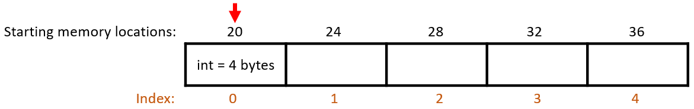
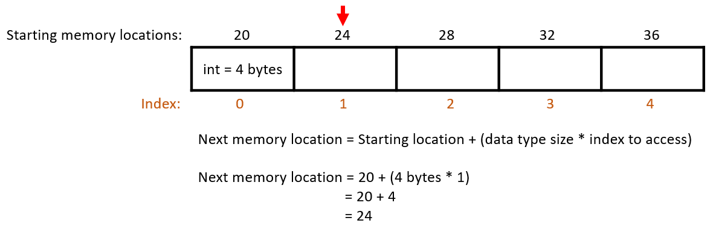
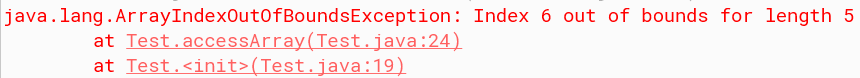
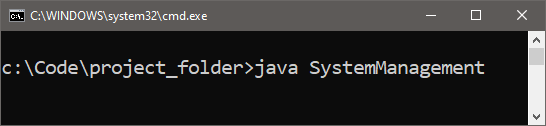
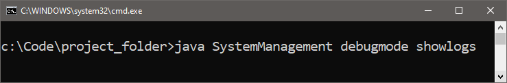
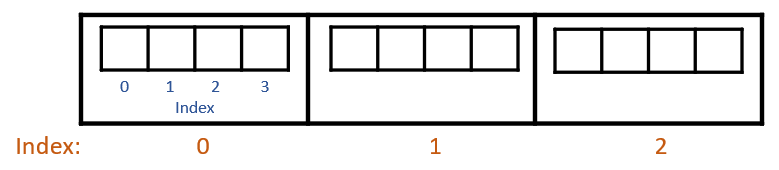
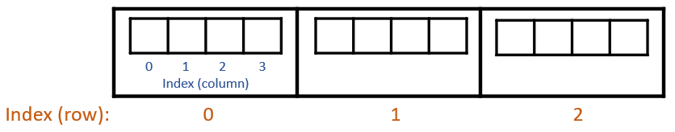

# Arrays

An array is a foundational data structure in programming. It consists of elements that occupy sequential memory spaces and are fixed in size once initialized. We can access those elements via an index which allows efficient retrieval and storage of data. Multidimensional arrays allow for more complex data structures, such as a table-like structure with rows and columns. 

Finally, by revisiting Java’s *main()* method, we can see how an array is used when providing command line arguments at an application’s launch.

## Learning Objectives

- Implement single and multidimensional arrays.
- Understand how data is stored in elements, and retrieved using indices.
- Understand how Java’s main() method accesses command line arguments through an array.

# What is an Array?
One of the oldest data structures in programming is an ***array***, and it’s used to manage multiple values under one variable or reference name. Data inserted into the array is stored in one of the sequentially reserved spaces in memory. These spaces, known as ***elements***, are equal in size based on the data type specified at declaration. An array is flexible in terms of the data types it can use, but it is fixed in the number of elements it can have. Once it has been created, you cannot add additional elements to the structure unless you recreate it. 


# Declaring Arrays
Arrays are unique in how they are declared. They utilize square brackets `[]` to tell the compiler to create an array based on the provided data type. This is odd compared to other variable declarations, but it’s for a good reason. This array declaration is similar to how older programming languages declare them. When Java was first introduced, it was easier to get other programmers to adopt the language since it shared similar syntax. It’s easier to switch to something else when you already know how some of it is set up.

The brackets follow the data type to be used. For example, the code segment below creates a variable, *studentIDs*, and declares it as an array of integer values:

```java
 private int[] studentIDs;
```

Likewise, if I wanted to create an array to hold a series of names, I would declare an array of Strings:

```java
 private String[] studentNames;
```

# Initializing Arrays
The next step is to initialize our array. When we do this, we need to specify how many spaces, or elements, to reserve in memory. Arrays are fixed in length, meaning once we initialize it and tell the computer how many spaces to reserve, it cannot be reduced or expanded. For example, we declared and initialized our *studentIDs* array to hold a maximum of 10 names. If later on we wanted to adjust the size of our array to store 18 names, we would have to declare a new array, initialize it to hold a maximum of 18 names, then move the original data from the old array to the new array.

There are two ways we can initialize arrays. The first option is to provide the array’s capacity. Inside of a constructor, you will create a new instance of the array, then specify the size of the array within the square brackets. Using the previous example, if I wanted to store a maximum of 10 names, I would initialize my *studentIDs* like so.

```java
 studentIDs = new int[10];
```

The second option is to provide the data to be stored in the array. When you provide the data set, the compiler looks at how many items will be stored, and initializes the array using that inferred size. 

```java	
 private int[] studentIDs = {122, 201, 351};
```

Note that initializing the array this way can only be done during declaration. If you wanted to provide a data set to initialize the array at a different point, you will need to use the new keyword.

```java
 private int[] studentIDs;
 studentIDs = new int[] {122, 201, 351};
```

# Index and Element
When it comes to retrieving data out of an array, the computer needs to know what ***index***, or position, to look at. This index represents the place in the array where an element resides. When you start counting by index, you actually start at zero, not one. The reason for this is due to how the computer locates the array’s data in memory.

Since array elements are sequential, and each element takes up the same amount of space, the computer only needs to keep track of the first element. It can then calculate where the next element starts based on the data type’s allocated size.

For example, if I have an array of integers, each element is 4 bytes of memory. Simplifying the memory addresses, the array’s first element is located at memory address 20 (Figure 5.1). Each box represents 4 bytes of memory. If I wanted to locate the second element of the array, the computer takes the starting memory address and adds the product of the array’s data type size and the index you want to access. In this case, it is adding (4 * 1). Therefore, the starting location of the second element is at memory address 24 (Figure 5.2).


<caption><strong>Figure 5.1: Starting location in memory for array index 0.</strong></caption>




<caption><strong>Figure 5.2: Next memory address for array index 1.</strong></caption>




By starting at 0 when counting by index, it allows the computer to point to the correct starting element. Otherwise, we would exclude the first element every time we try to access it in the array.


# Accessing Array Elements
When you want to retrieve or store an element from an array, you identify which element you want by putting the index within the square brackets. 

These brackets have a dual purpose. When you declare an array, you use these brackets to tell the computer how many elements, or spaces, you want to reserve for the array. After this point, the brackets are used to tell the computer what index you want to access.

If you want to assign a value to a particular index, you’ll call the array on the left side of the assignment operator, passing in the index you want to use. On the right side, you’ll state the value you want to store:

```java
 roster[0] = “Jenny”; //first element
 roster[1] = “Franklin”; //second element
 roster[2] = “Jake”; //third element
```

To retrieve a value stored at a particular index, you’ll use the same format as above like you would for any other variable.

```java
 System.out.println(“First student: “ + roster[0]);
 System.out.println(“Second student: “ + roster[1]);
 System.out.println(“Third student: “ + roster[2]);
```

<caption><strong>Console Output:</strong></caption>

```
 First student: Jenny
 Second student: Franklin
 Third student: Jake
```

You can also pass in an int variable that represents the index value.

```java
 int index = 1;

 roster[0] = “Jenny”; //first element
 roster[1] = “Franklin”; //second element
 roster[2] = “Jake”; //third element

 System.out.println(“Student: “ + roster[index]);
```

<caption><strong>Console Output:</strong></caption>

```
 Student: Franklin
```

# Length Field
When we initialize arrays and provide its starting element size, that value is stored in the array’s *length* field. This is a constant field, meaning once a value has been set it cannot change. This is the primary reason why arrays have to be recreated if more elements are needed.

This field is one that can be accessed directly. There are no methods available in the array data structure that will return the value held in *length*.

```java
 private int[] studentIDs = new int[5];

 System.out.println("Array length: " + studentIDs.length );
```

<caption><strong>Console Output:</strong></caption>

```
 Array length: 5
```

A situation where the array’s length field would be useful is when you want to make sure that the index you are using to access an element is valid.  For example, if I were to access the *studentIDs* array using index 6, I would get an ***ArrayIndexOutOfBoundsException***. 

```java
 System.out.println( studentIDs[6] );
```

<caption><strong>Figure 5.3: ArrayIndexOutOfBounds exception thrown due to attempt to access a non-existing index.</strong></caption>




6 is not a valid index in the *studentIDs* array, only values 0 to 5 are. If I set up a condition statement that checks to see if the index I want to access is less than the size of the array, I could mitigate the error from occurring.

```java
 int indexToCheck = 6;

 if ( indexToCheck < studentIDs.length )
 {
 	System.out.println( studentIDs[6] );
 }
 else 
 {
 	System.out.println(“Invalid index. Please try again.”);
 }
```

<caption><strong>Console Output:</strong></caption>

```
 Invalid index. Please try again.
```

# main() and Command Line Arguments
Java’s *main()* method is the default method of an application. Almost all of the Java tutorials you’ll come across online use this method for demonstrations. It is a static method, meaning it stays with the class and is not a part of an instance. Below is an example of how the *main()* method is structured.

```java
 public static void main(String[] args)
 {
	System.out.println(“Hello World”);
 }
```

Developers use this method as the starting point of their application. They designate the class that has the *main()* method as the primary class of an application prior to its deployment. When an end user launches that application, the computer goes into that primary class and executes the class’ *main()* method. 

An alternative way of launching a Java application is through the command prompt or terminal. This is the same action that occurs behind the scenes when an end user launches an application from the desktop. In the command prompt, once you navigate to your project folder, you’ll run the command below using the name of the class your *main()* method is in. In the case of the course management system, the *main()* method will be located in the SystemManagement class.

<caption><strong>Figure 5.4: Launching a Java application from the command line.</strong></caption>




Once this command has been executed, the computer goes to the class listed and calls the *main()* method, launching the application for end users to interact with. 

In the parameter list of the *main()* method is `String[] args`. This is used when you want to pass in ***arguments*** that affect the function of the application as a whole. Any additional commands provided after the initial launch command gets placed in the *args* array.

<caption><strong>Figure 5.5: Launching a Java application from the command line with arguments.</strong></caption>


 


The args array now has the the following elements:

**Index 0:** debugmode
**Index 1:** showlogs

A common use for this is running an application in debug mode. When the application checks for this argument and sees that it is being used, additional features, menu options, or text output will be available. An overly simplistic version of this is shown below. 

```java
 public static void main(String[] args)
 {
	System.out.println(“Hello World”);

	if(args[0].equals(“debugmode”))
	{
		System.out.println(“You have now entered debug mode”);
	}
 }
```

If the *main()* method is called without any arguments, only “Hello World” will be displayed to the terminal. If “debugmode” is the first argument passed into the *main()* method call, the “Hello World” and “You have now entered debugmode mode” phrases will be shown. 

The arguments used in your application are customizable to fit your needs. It is not required to operate a successful application, but it does allow you unlock features and runtime modes that are normally hidden from end users. 


# Multidimensional Arrays
***Multidimensional arrays*** allow you to store arrays within arrays. This is a common way to create data tables within your application. For this module, we will focus on 2 dimensional (2D) arrays even though 3- and 4D arrays are possible. 

An example of a 2D array’s structure is shown below in Figure 5.6. 

<caption><strong>Figure 5.6: 2D array structure.</strong></caption>


 


Another way of viewing this is in a table-like format that uses rows and columns. The main array (shown in black with orange indices in Figure 5.7) can be treated as the table’s rows, while the inner arrays (shown with blue indices) are the table’s columns. 

<caption><strong>Figure 5.7: Row/column equivalents in 2D arrays.</strong></caption>


 


## Declaring and Initializing 2D Arrays
2D arrays are declared and initialized in a similar manner as normal arrays with a small exception. While our normal arrays prior to this used a single set of square brackets, 2D arrays use 2 sets. Table 5.1 shows the sample data that we will use for the *studentContactInfo* array. 

<caption><strong>Table 5.1: Sample student data.</strong></caption>

| Student’s First Name	| Student’s Last Name	| Student’s Major |
| ----- | ----- | ----- |
| Olivia	| Harper	| Computer Science |
| Ethan	| Reynolds	| Civil Engineering |
| Sophia	| Carter	| Secondary Education |
| Liam	| Bennett	| Biology |


The code segment below is declaring *studentContactInfo* as a 2D array of Strings.

```java
 public String[][] studentContactInfo;
```

In the declaration statement there are two sets of square brackets. When we are initializing the 2D array, the first set of brackets is used to represent the number of rows needed for our sample data. In this case, we need four rows; the header row will not be included. The second set of brackets represents the number of columns needed, which is three.

```java
 studentContactInfo = new String[4][3];
```

## Accessing 2D Array Elements
2D array elements are at the intersection of the row and column indices. For example, using the sample data table, “Olivia” is located at the intersection of row index 0 and column index 0. “Biology” is located at the intersection of row index 3 and column index 2.


<table>
  <caption><strong>Table 5.2: Sample student data with row/column indices.</strong></caption>
  <thead>
    <tr>
      <th scope="col">Index</th>
      <th scope="col">0</th>
      <th scope="col">1</th>
      <th scope="col">2</th>
    </tr>
  </thead>
  <tbody>
    <tr>
      <th scope="row">0</th>
      <td>Olivia</td>
      <td>Harper</td>
      <td>Computer Science</td>
    </tr>
    <tr>
      <th scope="row">1</th>
      <td>Ethan</td>
      <td>Reynolds</td>
      <td>Civil Engineering</td>
    </tr>
    <tr>
      <th scope="row">2</th>
      <td>Sophia</td>
      <td>Carter</td>
      <td>Secondary Education</td>
    </tr>
    <tr>
      <th scope="row">3</th>
      <td>Liam</td>
      <td>Bennett</td>
      <td>Biology</td>
    </tr>
  </tbody>
</table>


In the code to assign “Olivia” to the first element in the row and in the first column, we would set up the assignment statement like this:

```java
 studentContactInfo[0][0] = “Olivia”;
```

Likewise, to assign “Biology” to the element in the last row and last column, the assignment statement would look like this:

```java
 studentContactInfo[3][2] = “Biology”;
```

Retrieving information follows the same format as a single array:

```java
 System.out.println(“First Name: “ + studentContactInfo[1][0]);
 System.out.println(“Last Name: “ + studentContactInfo[1][1]);
 System.out.println(“Major: “ + studentContactInfo[1][2]);
```

<caption><strong>Console Output:</strong></caption>

```
 First Name: Ethan
 Last Name: Reynolds
 Major: Civil Engineering
```

# Summary
**Array:** A data structure used to store multiple values in sequential memory spaces, where each element is of a fixed size based on its data type. Arrays are declared using square brackets (`[]`) and can store a predefined number of elements. Once initialized, arrays cannot be resized without recreating them.

**Array Initialization:** There are two ways to initialize arrays by either specifying the number of elements or directly providing the data. Accessing array elements requires referencing their index, which starts at zero.

**main()**: The *main()* method in Java is the starting point for applications, allowing the execution of the program. It can also accept command-line arguments and store them in the args array to influence the program’s behavior.

**Multidimensional Arrays:** Multidimensional arrays, such as 2D arrays, store data in a grid-like structure with rows and columns, allowing more complex data storage.


# Key Terms

- Arguments
- Array
- ArrayIndexOutOfBoundsException	
- Element	
- Index
- Multidimensional Array


# Review Questions

1.	What is an array in programming?
2.	How are array elements stored in memory?
3.	What does it mean that an array is fixed in size?
4.	How do you declare an array in Java?
5.	Why are square brackets ([]) used in array declarations?
6.	What is the difference between declaring and initializing an array?
7.	Give an example of how to initialize an array that needs to have 5 elements.
8.	Can you initialize an array without specifying its size? If so, give an example.
9.	What happens if you need to change the size of an array after it has been initialized?
10.	What does an index represent in an array?
11.	Why do arrays use zero-based indexing?
12.	How does the computer calculate the memory address of an element in an array?
13.	How do you retrieve an element from an array using its index? Give an example.
14.	What is the length field in an array, and how is it used?
15.	Why can't the length of an array be changed after initialization?
16.	What is an ArrayIndexOutOfBoundsException, and how can it be prevented?
17.	What is the main() method in Java, and what is its significance?
18.	What is the purpose of the String[] args parameter in the main() method?
19.	What is a multidimensional array, and how does it differ from a single-dimensional array?
20.	How are elements in a 2D array accessed? Give an example.
