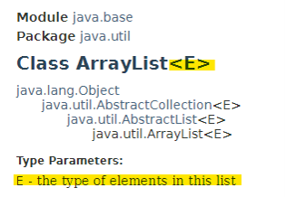
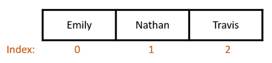
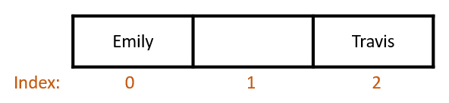
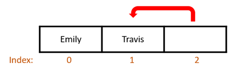
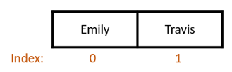

# Collections

The Java programming language provides a powerful toolset for building applications, offering developers a range of packages to streamline the coding process. Java packages include both standard libraries and third-party resources that encompass essential functions, from data handling and mathematical computations to database connectivity. These libraries eliminate the need for programmers to reinvent common functions, allowing them to incorporate prebuilt solutions to handle tasks. By leveraging these reusable code components, Java developers can build complex applications more efficiently while ensuring consistency and minimizing redundancies in their code. By using the keyword import, developers can easily integrate these packages, simplifying access to classes and methods across various functional areas, including data structures like ArrayList, HashSet, and HashMap. These collections are optimized for different storage and retrieval needs, further extending Java's utility in managing data effectively. 

## Learning Objectives

- Implement Java libraries in applications.
- Understand the advantages of generic classes.
- Describe the autoboxing process and how wrapper classes are involved.
- Implement and use ArrayList, HashSet, and HashMap collections within an application.

# Java Packages
Code libraries, also called ***packages***, provided by the Java programming language allow a programmer to use predefined functionality within their own application. These packages provide functionality ranging from various data structures and database integrations to mathematical functions and random number generation. Packages can also be provided by third-party vendors. These could provide a means to interact with their proprietary software or machinery.

The overall goal of these packages is to reduce the need to reinvent the wheel for every application. If something has already been created once, such as calculating the square root of a number, there’s no reason to rewrite it from scratch for every application that you develop. We could import Java’s Math class from the util package that already has the *sqrt()* method defined and use that in our code. Packages are provided to reduce the amount of time needed to develop applications, and to allow programmers to share some of the functionality that they’ve created with other developers. 

## import Keyword
In order to use a Java package, you can incorporate it into your classes using the `import` keyword. This allows you to utilize one or more classes within a package without having to make explicit calls to each method used.

Your `import` statements will be located at the top of your class outside of the class definition. The format is `import` followed by the package or class you want to include. If you wanted to use the Scanner class from Java’s util package, your `import` statement will be as follows. 

```java
import java.util.Scanner;

public class Student
{
	...
}
```

This allows you to use any of the publicly declared methods available to you in the Scanner class. The `import` statement can be used to bring in as many packages as needed for your application.

```java
import java.util.Scanner;
import java.util.Random;
import java.util.ArrayList;

public class Student
{
	...
}
```

Since the above code segment is using multiple classes out of the util package, we could also use an `import` statement that uses all classes under a specified package. The asterisk in this case is Java’s wildcard symbol. The statement reads as "select all classes within the util package".

```java
import java.util.*;

public class Student
{
	...
}
```

Importing classes in this manner does not increase the overall file size of the application. It may, however, increase the compilation time when importing several entire packages, but this will most likely be a negligible amount. Also, conflicts may occur when importing everything from packages that have classes of the same name. When that occurs, the compiler does not know which class to use. 


# Collections
**Collections** are a group of items of the same data type that are treated as one entity. In this module, we are going to cover ArrayLists, HashSets, and HashMaps. However, there are several other types of collections that you can create and interact with in Java.

## Generic Classes
With the skills set that we currently have, in order for us to create a method that would add an element to an array, we would have to write a method that would handle each individual data type being passed through a parameter. We would need an *add()* method with an int parameter. Then, a second *add()* method with a String parameter. Then, a third *add()* method for doubles, and so forth.

```java
public void add(int newValue)
{ 
	intArray[0] = newValue;
}

public void add(String newValue)
{ 
	StringArray[0] = newValue;
}

public void add(double newValue)
{ 
	doubleArray[0] = newValue;
}
```

This is very redundant and an example of code duplication. We are performing the same exact tasks, but with different data types. Even in a small scale application, this is not feasible. We cannot create duplicate methods to handle every possible data type there is. To get around this code duplication issue, there is a class type in Java called a generic class.

***Generic classes*** have the same functionality built-in, but it is data type agnostic. No matter what data type you toss at it, it will function the same exact way. Generic classes allow the programmer to write one class with methods that accept any data type, from primitive and object types in the Java language to custom types created in your own classes.T

An example of this is the ArrayList class. This class is responsible for storing and managing elements within a collection in a specific format, but instead of having a class specifically for an ArrayList of Strings and another class specifically for an ArrayList of integers, it utilizes a single class with a ***type parameter***. This type parameter specifies what data type the generic class should use. This is defined in the ***diamond notation*** (`<>`) after the generic class name during declaration. In the example below, we are declaring an ArrayList of Strings. The String data type in the diamond notation is telling the compiler what data type we want to use within this collection.

```java
private ArrayList<String> names;
```

### Documentation

If you were to look at the official documentation for any generic class, again using ArrayList as an example, you’ll notice that the diamond notation has an ‘E’ listed in it. This is denoting that whatever data type is placed here is going to be the data type of all elements within this list structure.

<caption><strong>Figure 7.1: Official documentation header for the ArrayList class showing the element type parameter.</strong></caption>


 

Other type parameter notations exist for generic class documentation. Table 7.1 is a list of what is commonly used. 

<caption><strong>Table 7.1: Type parameter notation.</strong></caption>

| Type Parameter Notation	| Meaning |
| ----- | ----- |
| E	| Element (Used by Collections Framework) |
| T	| Type |
| K	| Key |
| V	| Value |


# Wrapper Classes and Autoboxing

There’s one catch when we’re dealing with some collections, such as ArrayList, HashMap and HashSet: these collections cannot use primitive data types. They only interact with object data types. In order for us to utilize a collection that stores data types such as int, double, and char, we need to turn our primitive types into an object. 

***Wrapper classes*** are the object equivalent to primitive data types. Using a process called ***autoboxing***, wrapper classes enclose a primitive data type in an object format. Each of the eight primitive data types has their own wrapper classes as shown in Table 7.2.


<caption><strong>Table 7.2: Primitive data types and their respective wrapper class.</strong></caption>

| Primitive Data Type	| Wrapper Class Equivalent |
| ----- | ----- |
| byte	| Byte |
| short	| Short |
| int	| Integer |
| long	| Long |
| float	| Float |
| double	| Double |
| char	| Character |
| boolean	| Boolean |
 

If we wanted to create a collection of characters, we would need to use the Character wrapper class as part of the collection’s declaration. Anytime we add a char value, the autoboxing process takes the char value and encloses it in a Character object. Then, the collection can proceed with its functionality. If the primitive data type is needed, the reverse process, ***unboxing***, removes the Character object and returns the original char value.


# ArrayList, HashSet, and HashMap Classes

The ArrayList, HashSet, and HashMap classes are part of the java.util package. To use these in your code, you will need to import the classes from the java.util package.

```java
import java.util.ArrayList;
import java.util.HashSet;
import java.util.HashMap;

public class Course
{
	...
}
```

Since all three classes belong to the same package, we can also use a wildcard to import all classes in the util package.

```java
import java.util.*;

public class Course
{
	...
}
```

## ArrayList

An ***ArrayList*** is a data structure that incorporates the index of an array, but has the flexibility of a list. Lists are dynamic in size meaning that you do not specify how many items this collection can hold when initialized. Each time an item is added to it, it is placed at the end by default.

After importing the ArrayList class, you’ll create your variable using the ArrayList class passing in the data type you want to use in the collection inside the diamond notation. Below we are declaring an ArrayList of Strings.

```java
public class Course
{
	private ArrayList<String> studentNames;

	...
}
```

To initialize the *studentNames* variable, we will create a new instance of the ArrayList class. The diamond notation in the new instance syntax does not need the collection’s data type. It is inferred from the previous declaration statement.

```java
studentNames = new ArrayList<>();
```

### Common ArrayList Methods

#### add()

When an item is added, the new values are added to the end of the ArrayList collection.

```java
studentNames.add("Emily");
studentNames.add("Nathan");
studentNames.add("Travis");
```

When we loop through the values in *studentNames*, we see that names are listed in the order that we added them.

```java
for (String name : studentNames)
{
	System.out.println(name);
}
```

<figure><figcaption>Console Output:</figcaption><pre>
Emily
Nathan
Travis
</pre></figure>

ArrayLists can contain duplicates. If we add "Emily" again it will be tacked onto the end of the ArrayList.

```java
studentNames.add("Emily");
 
for (String name : studentNames)
{
	System.out.println(name);
}
```

<figure><figcaption>Console Output:</figcaption><pre>
Emily
Nathan
Travis
Emily
</pre></figure>

#### size()

The *size()* method returns the number of elements that are currently in the ArrayList collection. When using this on the *studentNames* collection, the method will return the value 3.

```java
studentNames.size();
```

**Returned Value:** 3

#### get()

The ArrayList collection retrieves values based on an index just like arrays. The *get()* method, when provided with an index, will go to that position in the ArrayList and retrieve the data stored in that element.

```java
studentNames.get(1);
```

**Returned Value:** Nathan

#### remove()

The *remove()* method removes the element that matches either an object or an index you provide. Below is the code snippet to remove the name "Nathan". If we loop through the *studentNames* collection again, we see that "Nathan" has been removed from the ArrayList.

```java
studentNames.remove("Nathan");
      
for (String name : studentNames)
{
	System.out.println(name);
}
```

<figure><figcaption>Console Output:</figcaption><pre>
Emily
Travis
</pre></figure>

When items are removed from the middle of an ArrayList, all subsequent elements are shifted to fill in the gap. Then, the empty element at the end of the ArrayList is removed.

<caption><strong>Figure 7.2: The ArrayList elements prior to removing "Nathan".</strong></caption>




<caption><strong>Figure 7.3: Once "Nathan" has been removed, an empty space is left.</strong></caption>


 
<caption><strong>Figure 7.4: The elements are shifted over one space to fill in the gap. This process repeats from the index of the removed element to the end of the collection.</strong></caption>



<caption><strong>Figure 7.5: The adjusted ArrayList after element shifting.</strong></caption>




If we wanted to remove a name based on an index, we would use the same method, but provide an index.

```java
studentNames.remove(0);
      
for (String name : studentNames)
{
	System.out.println(name);
}
```

<figure><figcaption>Console Output:</figcaption><pre>
Travis
</pre></figure>

The same process of shifting elements after removal occurs for this version as well.

#### contains()

The *contains()* method, which returns a boolean value, takes the object it's provided and checks to see if there is a matching object within the collection. If there is, the method returns true. Otherwise, it returns false.

```java
studentNames.contains("Nathan");
```

**Returned Value:** false

#### clear()

The *clear()* method removes all elements from the collections.

```java
studentNames.clear();
```

#### isEmpty()

The *isEmpty()* method checks the ArrayList to see if it contains any elements. If there are no elements present, the method returns true. Otherwise, it returns false.

```java
studentNames.isEmpty();
```

**Returned Value:** true


> [!NOTE]
> The *size()*, *remove()*, *contains()*, *clear()*, and *isEmpty()* methods are available in most of the collections you’ll see in Java. They have similar functionality in those collections as well.


## HashSet

***HashSets***, a member of the java.util package, are a collection of unique items. Unlike an ArrayList that takes in multiples of the same item and adds them to its collection, HashSets only takes in one copy.

After importing the class, you’ll declare a HashSet variable passing in the data type you want to use in the collection inside the diamond notation. Below we are declaring a HashSet of integers.

```java
public class Course
{
	private HashSet<Integer> studentIDs;

	...
}
```

To initialize the *studentIDs* variable, we will set it to a new instance of the HashSet class. Just like with ArrayLists, the diamond notation in the new instance syntax does not need the collection’s data type.

```java
studentIDs = new HashSet<>();
```


### Common HashSet Methods

#### add()

When an item is added, the computer checks to see if that item already exists in the collection. If it does not exist, the item is added. If that item is already there, the computer ignores it.

```java
studentIDs.add(133);
studentIDs.add(834);
studentIDs.add(654);
studentIDs.add(133);
studentIDs.add(728);
```

One line 4, we are attempting to add the ID 133. We already added that ID on line 1. When we loop through the values in the *studentIDs* HashSet, we see that ID 133 is only listed once.

```java
for (Integer ID : studentIDs)
{
	System.out.println(ID);
}
```

<figure><figcaption>Console Output:</figcaption><pre>
133
834
654
728
</pre></figure>

#### size()

The *size()* method returns the number of elements that are currently in the HashSet collection. When using this on the *studentIDs* collection, the method will return the value 4.

```java
studentIDs.size();
```

Returned Value: 4

#### remove()

The *remove()* method removes the element that matches the object you provide. Below is the code snippet to remove the ID 834. If we loop through the *studentIDs* collection again, we see that 834 has been removed from the HashSet.

```java
studentIDs.remove(834);
      
for (Integer ID : studentIDs)
{
	System.out.println(ID);
}
```

<figure><figcaption>Console Output:</figcaption><pre>
133
654
728
</pre></figure>

#### contains()

The *contains()* method takes the object it's provided and checks to see if there is a matching object within the collection. The end results are the same as for ArrayList.

```java
studentIDs.contains(133);
```

Returned Value: true

#### clear()

The *clear()* method removes all elements from the collections.

```java
studentIDs.clear();
```

#### isEmpty()

The *isEmpty()* method checks the HashSet to see if it contains any elements, returning a boolean value as the end result.

```java
studentIDs.isEmpty();
```

Returned Value: true


## HashMap

***HashMaps*** are a key/value pair structure. Keys in this structure must be unique. Much like the HashSet, HashMap cannot have a duplicate item as a key. However, the value portion of the HashMap can be duplicated. This is similar to an English dictionary. Words that are being defined are listed once, but each word can have multiple definitions.

Once you’ve imported the class, declare a HashMap instance. This time, you’ll pass in the data type of the key and the value you want to use in the collection inside the diamond notation. The data types used do not need to be the same. Below we are declaring a HashMap using an integer as the key data type and the Student class as the value data type.

```java
public class Course
{
	private HashMap<Integer, Student> studentRecords;

	...
}
```

To initialize the *studentRecords* HashMap, we will set it to a new instance of the HashMap class. Again, the diamond notation in the new instance syntax does not need the collection’s key and value data types.

```java
studentRecords = new HashMap<>();
```

### Common HashMap Methods

#### put()

When you add an item to a HashMap, you need to provide the key you want to reference the entry by and the value associated with it. When an item is added, the computer checks to see if that key already exists in the collection. If it does not exist, the item is added. If that item is already there, the computer overwrites the value associated with it with the new data that’s provided. Below we are going to add an instance of the Student class using the student’s ID as the key

```java
Student studentA = new Student("Emily", "Smith");
Student studentB = new Student("Nathan", "Brown");
Student studentC = new Student("Travis", "Poe");

studentRecords.put(133, studentA);
studentRecords.put(834, studentB);
studentRecords.put(654, studentC);
```

You can visualize this structure like a table. The left column being your keys, the right being what that key is associated with.


<table>
    <caption><strong>Table 7.3: HashMap with an Integer key and Student object values.</strong></caption>
    <thead>
        <tr>
            <th>Key (Integer)</th>
            <th>Value (Student instance)</th>
        </tr>
    </thead>
    <tbody>
        <tr>
            <td>133</td>
            <td>
                firstName = "Emily"<br>
                lastName = "Smith"
            </td>
        </tr>
        <tr>
            <td>834</td>
            <td>
                firstName = "Nathan"<br>
                lastName = "Brown"
            </td>
        </tr>
        <tr>
            <td>654</td>
            <td>
                firstName = "Travis"<br>
                lastName = "Poe"
            </td>
        </tr>
    </tbody>
</table>


#### keySet()

The *keySet()* method returns the keys used in the HashMap. This can be used later on with *get()* to loop through the HashMap values.

```java
System.out.println(studentRecords.keySet());
```

<figure><figcaption>Console Output:</figcaption><pre>
[834, 133, 654]
</pre></figure>

#### size()

The *size()* method returns the number of elements that are currently in the HashMap collection. When using this on the *studentRecords* collection, the method will return the value 3.

```java
studentRecords.size();
```

Returned Value: 3

#### get()

The *get()* method, when provided a key, will find the entry in the HashMap and return the value associated with it.

```java
studentRecords.get(654);
```

<figure><figcaption>Returned Student Instance:</figcaption><pre>
firstName = "Travis"
lastName = "Poe"
</pre></figure>

Also, you can use this method in conjunction with the *keySet()* method to loop through all entries within the HashMap.

```java
for (Integer key : studentRecords.keySet())
{
	System.out.println(studentRecords.get(key).toString());
}
```

<figure><figcaption>Console Output:</figcaption><pre>
Brown, Nathan
Smith, Emily
Poe, Travis
</pre></figure>

#### remove()

The *remove()* method removes the element that matches the key you provide. Below is the code snippet to remove the Student instance (value) stored at student ID (key) 834. If we loop through the *studentRecords* collection again, we see that key 834 and the associated Student instance has been removed.

```java
studentRecords.remove(834);
      
for (Integer key : studentRecords.keySet())
{
	System.out.println(studentRecords.get(key).toString());
}
```

<figure><figcaption>Console Output:</figcaption><pre>
Smith, Emily
Poe, Travis
</pre></figure>

#### containsKey()

Similar to the *contains()* in the previous collections, the *containsKey()* method checks to see if the provided key is used in the HashMap, returning true if it’s there.

```java
studentRecords.containsKey(133);
```

Returned Value: true

#### containsValue()

In conjunction with the *containsKey()* method, the *containsValue()* method checks to see if the provided object is a value stored in the HashMap.

```java
Student studentToFind = new Student("Emily", "Smith");

studentRecords.containsKey(133);
```

Returned Value: true

#### clear()

The *clear()* method removes all entries from the collections.

```java
studentRecords.clear();
```

#### isEmpty()

If there are no entries present in the HashMap, the method returns true. Otherwise, it returns false.

```java
studentRecords.isEmpty();
```

Returned Value: true


## Method Summary for ArrayList, HashSet, and HashMap

<table>
    <caption><strong>Table 7.4: Method summary for collections, and which methods apply to what collection.</strong></caption>
    <thead>
        <tr>
            <th>Method Name</th>
            <th>What Does It Do?</th>
            <th>ArrayList</th>
            <th>HashSet</th>
            <th>HashMap</th>
        </tr>
    </thead>
    <tbody>
        <tr>
            <td>add(E)</td>
            <td>Adds an object to the collection</td>
            <td>X</td>
            <td>X</td>
            <td></td>
        </tr>
        <tr>
            <td>put(K, V)</td>
            <td>Adds a key/value pair to the collection</td>
            <td></td>
            <td></td>
            <td>X</td>
        </tr>
        <tr>
            <td>get(*)</td>
            <td>Retrieves an element from the collection</td>
            <td>
                X<br>
                <em>*Provide index</em>
            </td>
            <td></td>
            <td>
                X<br>
                <em>*Provide key</em>
            </td>
        </tr>
        <tr>
            <td>keySet()</td>
            <td>Returns the keys in a map as a set</td>
            <td></td>
            <td></td>
            <td>X</td>
        </tr>
        <tr>
            <td>remove(*)</td>
            <td>Removes an element from the collection</td>
            <td>
                X<br>
                <em>*Provide index</em>
            </td>
            <td>
                X<br>
                <em>*Provide object</em>
            </td>
            <td>
                X<br>
                <em>*Provide key</em>
            </td>
        </tr>
        <tr>
            <td>clear()</td>
            <td>Removes all elements from the collection</td>
            <td>X</td>
            <td>X</td>
            <td>X</td>
        </tr>
        <tr>
            <td>contains(E)</td>
            <td>Checks the collection to see if a matching element exists</td>
            <td>X</td>
            <td>X</td>
            <td></td>
        </tr>
        <tr>
            <td>containsKey(K)</td>
            <td>Checks the collection to see if a matching key exists</td>
            <td></td>
            <td></td>
            <td>X</td>
        </tr>
        <tr>
            <td>containsValue(V)</td>
            <td>Checks the collection to see if a matching value exists</td>
            <td></td>
            <td></td>
            <td>X</td>
        </tr>
        <tr>
            <td>size()</td>
            <td>Returns the number of elements within the collection</td>
            <td>X</td>
            <td>X</td>
            <td>X</td>
        </tr>
        <tr>
            <td>isEmpty()</td>
            <td>Returns true if there are no elements within the collection</td>
            <td>X</td>
            <td>X</td>
            <td>X</td>
        </tr>
    </tbody>
</table>


# Summary

**Packages:** Java packages provide a collection of predefined libraries to simplify coding, offering essential functionality for tasks like:
- Data manipulation
- Mathematical operations
- Database integration

**Import:** This keyword enables developers to easily integrate these packages into applications, reducing the need to write repetitive code.

**Collections:** A way to store multiple entities under one reference name. Each collection has its own way of adding and retrieving items within it.

- ArrayList: Stores elements in an ordered list with dynamic sizing.
- HashSet: Manages unique items without allowing duplicates.
- HashMap: Uses key-value pairs for efficient data storage and retrieval.

**Generic Classes:** Allow methods to handle different data types without duplicating code, providing flexibility across data types.

**Wrapper Classes:** Converts primitive data types into objects (e.g., int to Integer), enabling compatibility with Java collections.


# Key Terms

- ArrayList
- Autoboxing
- Collections
- Generic Class
- HashMap
- HashSet
- `import`
- Packages
- Type Parameter
- Unboxing
- Wrapper Class


# Review Questions

1.	What is the purpose of Java packages, and how do they benefit developers?
2.	Explain the `import` keyword in Java. Where should `import` statements be placed in your code? Give an example of importing the Currency class from Java’s util package.
3.	What are the differences between ArrayList, HashSet, and HashMap?
4.	What is the benefit of using Java’s generic classes, and how do they help reduce code duplication?
5.	What are wrapper classes, and why are they necessary for certain Java collections like ArrayList?
6.	How does autoboxing work, and what role does it play in Java collections?
7.	What does the *add()* method do in an ArrayList or HashSet, and how do the two collections handle duplicates?
8.	List some common methods shared by Java collections like ArrayList, HashSet, and HashMap. How does each method function?
9.	Explain the purpose of the *contains()* method. How is it used in collections such as ArrayList and HashSet?
10.	What does the *clear()* method do in Java collections, and when might it be useful in an application?
